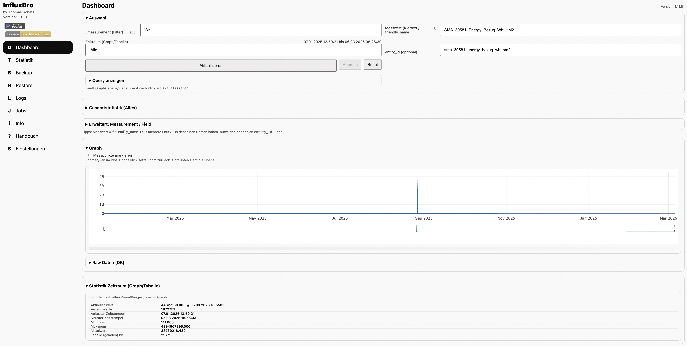
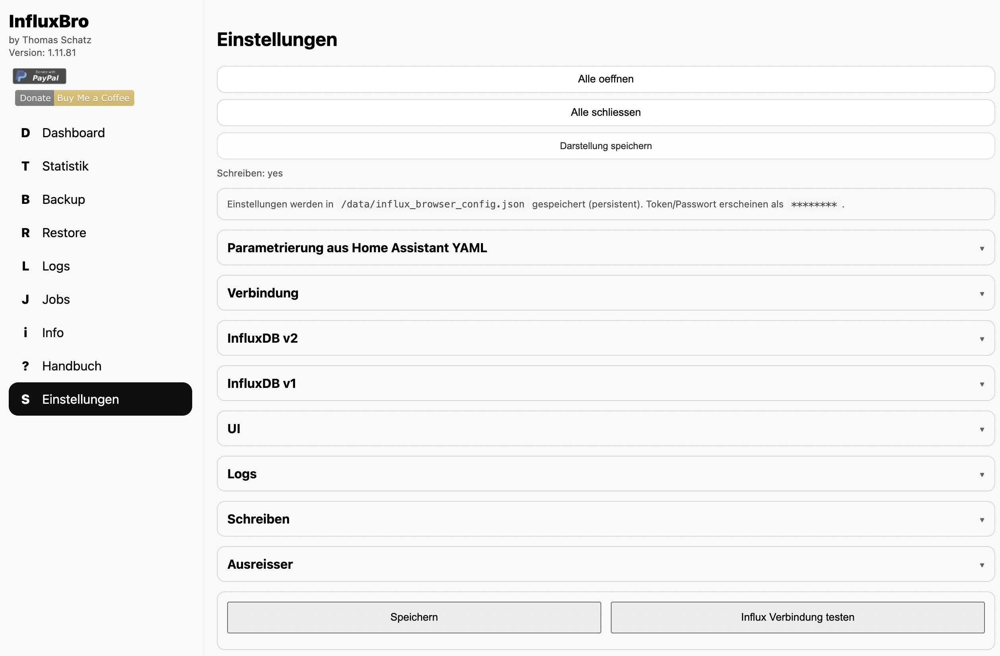
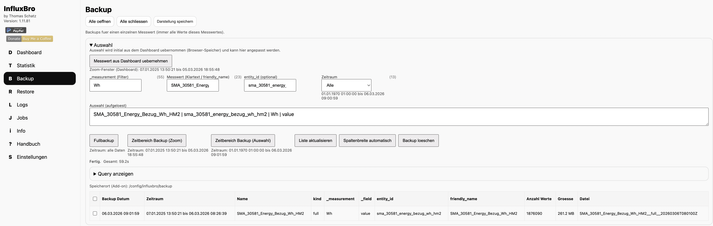
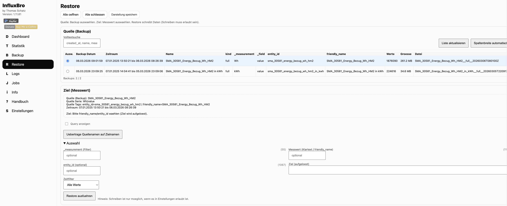
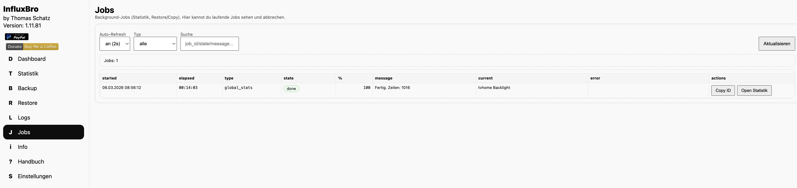
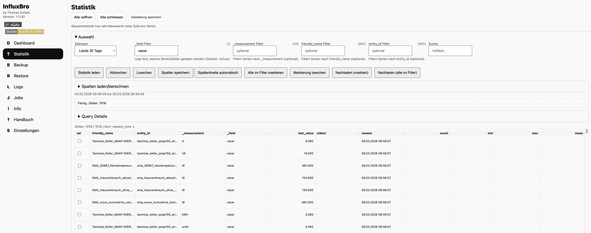

# InfluxBro Handbuch

InfluxBro hilft dir, InfluxDB-Zeitreihen aus Home Assistant zu durchsuchen, auszuwerten, zu sichern und bei Bedarf Werte gezielt zu korrigieren.

Hinweis: In Home Assistant heisst das Add-on/Panel "InfluxBro".

Dieses Handbuch ist absichtlich sehr konkret: Jedes sichtbare Element in der GUI wird beschrieben, damit du immer weisst, wofuer es ist.

## Screenshots

Aktuelle UI (Beispiele):

### Uebersicht (Dashboard)

### Einstellungen

### Backup

### Restore

### Logs

### Jobs & Cache

### Statistik

## Navigation

Links findest du die Bereiche:

- Dashboard: Messwerte auswaehlen, Graph/Tabelle ansehen, Ausreisser finden und Werte direkt in der Bearbeitungsliste bearbeiten.
- Statistik: Gesamtstatistik ueber viele Serien anzeigen.
- Monitor: Ueberwachte Messwert-Keys pruefen, Fault-Phasen verfolgen, offene Korrekturen verwalten und Template-Status abrufen.
- Backup: Backups fuer einen einzelnen Messwert erstellen und verwalten.
- Restore: Ein vorhandenes Backup fuer einen Messwert wiederherstellen.
- Kombinieren: Datenpunkte zwischen zwei Messwerten kopieren (z.B. bei Entity-ID Umbenennung) inkl. Vorschau.
- Logs: Add-on Logs von InfluxBro ansehen (Menuepunkt ist unter Restore einsortiert).
- Jobs & Cache: Laufende Background-Jobs ansehen (Statistik/Restore/Cache) und abbrechen.
- Info: Influx Datenbank Diagnose (best-effort).
- Changelog: Release Notes.
- Handbuch: Diese Dokumentation.
- Einstellungen: Influx-Verbindung und UI-Parameter konfigurieren.

Im Sidebar-Kopf wird ausserdem die aktuell laufende Add-on Version angezeigt.

Neu: Top-Leiste (Profil + Zoom)

- Ganz oben gibt es eine fixe Leiste (scrollt nicht mit), die immer sichtbar bleibt.
- Enthalten:
  - Profil-Auswahl inkl. `Anwenden`, `Speichern`, `Info` und die aktuelle Version.
  - Zoom-Steuerung: `-` / `+` und die aktuelle Zoomstufe in `%`.
- Zoom wird im Browser gespeichert (pro Browser/Client).

## Installation in Home Assistant

1) Add-on Repository hinzufuegen

- Home Assistant: `Einstellungen -> Add-ons -> Add-on Store`
- Oben rechts: `... -> Repositories`
- Repository-URL eintragen: `https://github.com/thomas682/HA-Addons`

2) Add-on installieren und starten

- Add-on `InfluxBro` aus dem Add-on Store auswaehlen
- `Installieren` -> `Starten`
- Optional aber empfohlen: Schalter `In Seitenleiste anzeigen` aktivieren (damit InfluxBro links in der Seitenleiste erscheint)

3) Web UI oeffnen

- Im Add-on: `Open Web UI` (Ingress)

4) InfluxDB konfigurieren

- In der InfluxBro UI: `Einstellungen`
- Optional: YAML Import (Abschnitt "Parametrierung aus Home Assistant YAML")
- `Influx Verbindung testen` -> `Speichern`

## Monitor

- Die Seite `Monitor` ist fuer laufende Ausreisser-Ueberwachung gedacht. Sie arbeitet mit frei definierbaren Messwert-Keys und einer persistierten Fault-Phase (`normal`, `fault_active`, `recovering`).
- Die Seitensuche im Titelbereich verwendet dieselbe Breite wie auf den anderen Seiten und wird nicht mehr vom Formularbereich der Monitor-Seite ueberdehnt.
- Bereich `Monitoring Konfiguration`:
  - Pro Zeile definierst du `Key`, `Label`, `Min`, `Max`, maximalen `Anstieg`, maximalen `Abfall`, ob `0` als ungueltig gilt, den Korrekturmodus (`pending` oder `auto`) und die Recovery-Regeln.
  - Zusaetzlich kannst du pro Ausreissergrund eigene Korrekturaktionen setzen (`last_valid`, `delete`, `clamp`, `none`).
- Bereich `Wert pruefen / einspeisen`:
  - Sendet einen Rohwert an `/api/monitoring/evaluate`.
  - Wenn ein Messwert in eine Stoerung kippt, bleibt `fault_active` bestehen, bis die konfigurierte Recovery-Regel erfuellt ist.
- Listen auf der Seite:
  - `Template-Status`: aktueller Rohwert, korrigierter Wert, letzter gueltiger Wert, letzter Grund, Pending-Anzahl, Kritisch-Flag und Fault-Flag.
  - `Offene Korrekturen`: vorgeschlagene Korrekturen koennen uebernommen, verworfen oder mit manuellem Ersatzwert abgeschlossen werden.
  - `Kritische Werte`: Messwerte, die die konfigurierte Wiederholschwelle fuer Fehler erreicht haben.
  - `Alle Ausreisser / Monitoring-Events`: technisches Log fuer Ausreisser, Recovery und Pending-Aktionen.
- API/Weiterverarbeitung:
  - `/api/monitoring/config`: Monitoring-Konfiguration laden/speichern.
  - `/api/monitoring/evaluate`: Rohwert pruefen und Status fortschreiben.
  - `/api/monitoring/events`, `/api/monitoring/pending`, `/api/monitoring/critical`: Listen fuer UI, Visu und Support.
  - `/api/monitoring/templates`: strukturierte JSON-Daten fuer globale Zaehler und pro Messwert den aktuellen Monitoring-Zustand.

## Dashboard (typischer Ablauf)

### 1) Messwert auswaehlen

- `_measurement`: Auswahl der Datenbankspalte `_measurement`.
- `_field`: Auswahl der Datenbankspalte `_field`. Wenn mehrere passende Fields gefunden werden und `value` dabei ist, wird `value` automatisch gesetzt.
- `friendly_name`: Auswahl der Datenbankspalte `friendly_name`.
- `entity_id`: Auswahl der Datenbankspalte `entity_id`.

Sichtbare Feldnamen im Dashboard:

- `_measurement` -> `Einheit`
- `_field` -> `Feld`
- `entity_id` -> `Entity`
- `friendly_name` -> `Name`

Die Auswahlelemente sind auf maximal 60% Breite begrenzt; Labels und Hinweistexte darunter orientieren sich an derselben Breite.
Die Labels `Einheit` und `Feld` zeigen wieder die aktuelle Anzahl der verfuegbaren Optionen direkt daneben an.
Auch nach dynamischen Refreshs und Vorschlagslisten-Updates werden keine Inline-Breiten mehr gesetzt, damit diese 60%-Begrenzung stabil wirksam bleibt.

Alle Felder, die frueher automatisch einen Clear-Button erhalten haben, besitzen jetzt dauerhaft einen statischen Clear-Button mit dem urspruenglichen Papierkorb-Icon direkt neben dem Feld.

Die vier Auswahlfelder `_measurement`, `_field`, `friendly_name` und `entity_id` verwenden dieselbe Kaskadenlogik wie auf der Backup-Seite. Wenn du eines der Felder aenderst, werden die anderen Listen sofort mit den gefilterten Datenbankwerten neu geladen. Der Zeitraum beeinflusst diese vier Vorschlagslisten nicht; er steuert nur die spaetere Datenabfrage fuer Graph, Tabelle und Statistik. Fuer Selector-Requests ohne explizites `range` wird serverseitig ein begrenztes Default-Fenster (`24h`) verwendet, damit Vorschlagslisten auch bei grossen Buckets stabil bleiben. Beim Dashboard-Start werden die Selector-Listen einmal deterministisch geladen; ein zusaetzlicher zeitversetzter Hintergrund-Reload wird nicht mehr gestartet.

Die Felder `Feld`, `Name` und `Grund Filter` besitzen jetzt jeweils einen dauerhaft sichtbaren Button `Feld leeren` direkt neben dem Eingabefeld.

Auch `_measurement`-Werte mit Sonderzeichen wie `°F` werden direkt ueber die echten Daten gefiltert. Wenn es zu einem Measurement keine passenden Fields, friendly_names oder Entity IDs gibt, bleiben die anderen Listen entsprechend leer.

Unter den Filtern zeigt `Auswahl (aufgeloest)` den finalen Stand der Auswahl an - analog zur Export-Seite. Dort siehst du direkt, welche Werte fuer `_measurement`, `_field`, `friendly_name`, `entity_id` und Zeitraum aktuell wirksam sind.

Wenn das Log-Profil auf `debug` steht, protokolliert InfluxBro jetzt jede Auswahlaktion in diesen vier Feldern sowie jede neu geladene Vorschlagsliste inklusive aller Eintraege und verwendeter Filter im Logfile.

Weitere Elemente:

- `Erweitert: Measurement / Field`: zeigt die intern aufgeloesten Werte `_measurement` und `_field`.
- `Aktualisieren`: laedt Graph und Statistik fuer den aktuellen Zeitraum.

Hinweis:

- Wenn du das Dashboard oeffnest und noch keine Auswahl (friendly_name/entity_id) gesetzt ist, wird der letzte Graph best-effort aus dem serverseitigen Cache unter `/data` wiederhergestellt.
- `Donate`/`PayPal`: Link zur freiwilligen Unterstuetzung.
- Zusaetzlich gibt es einen "Buy me a coffee" Spendenlink.

Tipp: Wenn du mit der Maus ueber einem Button/Checkbox/Auswahlfeld bleibst, zeigt der Tooltip eine kurze Erklaerung plus den internen UI-Key in Klammern (z.B. `Dieser Button aktualisiert die Liste (dashboard.load)`). Damit kannst du mir exakt sagen, welches Element du meinst.

Die Seitensuche in der Titelzeile (`page.search`) springt jetzt wieder mit sichtbarem Trefferrahmen zum gewaehlten Element. Farbe, Rahmenbreite und Sichtdauer kannst du in den Einstellungen anpassen.
- Neben dem Suchfeld gibt es jetzt `Zurueck`/`Weiter` fuer Treffer-Navigation sowie ein Such-Zahnrad mit Filterdialog.
- Der Suchdialog kann die Quellen `Label`, `sichtbarer Text`, `data-ui / id`, `Bereichspfad` und `Tooltiptexte` einzeln ein-/ausschalten; die Auswahl wird gespeichert.
- Zusaetzlich gibt es die Suchquelle `Direkt Text`; sie durchsucht nur direkte Textknoten des Elements und nicht rekursiv den gesamten Child-Text.
- Die Vorschau im Suchdialog reagiert sofort auf jede Checkbox-Aenderung und beruecksichtigt dabei den aktuell eingegebenen Suchtext.
- Der Suchdialog schliesst nur noch ueber den Button `Schliessen`.
- Klickst du bei vorhandenem Suchtext erneut in `page.search`, wird die aktuelle Trefferliste wieder eingeblendet.

Weitere Dashboard-Anpassungen:

- `Dashboard Query`, `Gesamtstatistik (Alles)` und `Statistik Zeitraum (Graph/Tabelle)` werden jetzt ueber modale Dialoge geoeffnet.
- Dieselbe modale Dialoglogik gilt jetzt auch konsistent fuer Statistik-, Backup- und FullBackup-Querys; Copy, History und Logs laufen dort ueber denselben Dialog.
- Der fruehere Raw-Query-Bereich wurde entfernt. Oberhalb der Raw-Tabelle gibt es jetzt einen eigenen Refresh-Button fuer dieselbe sichtbare Raw-Sicht.
- `Graph neu zeichnen` laedt die aktuelle Serie erneut aus InfluxDB und behaelt dabei den aktuellen Ausschnitt inklusive Overlays und Punktinfos bei.
- Die fruehere Box `Quelle (aufgeloest)` wurde entfernt; im Dashboard bleibt nur noch die eigentliche Auswahlleiste.
- Wenn du Raw-Werte oder vorgemerkte Aenderungen schreibst, werden Graph, Raw-Daten und eine aktive Ausreissersuche danach zusammen neu geladen; der aktuelle Ausschnitt bleibt dabei erhalten.
- Bearbeitungsliste und Details-Liste haben jetzt ebenfalls einen horizontalen Hoehen-Resizer wie die anderen Tabellenbereiche.
- Die Bearbeitungsliste hat keine Action-Spalte mehr; die Aktionen `Ueberschreiben`, `Loeschen`, `Uebernehmen` und `Undo` sitzen in der Toolbar oberhalb der Tabelle.
- Raw-Wert-Ueberschreibungen bestaetigst du jetzt ueber einen InfluxBro-eigenen modalen Dialog statt ueber den Browser-Confirm.

Hinweis: Zeitstempel werden im gesamten UI inklusive Millisekunden angezeigt.

## Tabellen (Allgemein)

- Jede Tabelle ist als eigener Block mit Rahmen und eindeutiger Tabellenueberschrift dargestellt.
- Ueber jeder Tabelle werden Zeilen angezeigt als `gefiltert / gesamt` (Rows).
- Spalten koennen ueber den Spalten-Button (neben dem Info-Icon) ein-/ausgeblendet werden (wird gespeichert).
- Das Info-Icon (i) erklaert je Tabelle Sinn/Zweck, Spalten und Aktionen.
- Zusaetzlich haben viele Bereiche neben dem Bereichstitel ein Info-Icon, das die komplette Sektion ausfuehrlich erklaert (Popup ist resizable, hat Umbruch + Copy).
- Die Summary-Balken fuer einklappbare Bereiche laufen jetzt ueber die komplette Summary-Zeile inklusive Auf-/Zuklappsymbol und verwenden ein einheitliches Balken-Layout.

## UI-Profile

- In der Sidebar kannst du ein Profil auswaehlen (Default: `PC`, `MOBIL`).
- Profile werden filebasiert unter `/data/ui_profiles` gespeichert.
- Das aktive Profil ist global (gilt fuer alle Clients/Browsers).
- In `Profilverwaltung` kannst du Profile anlegen, umbenennen, loeschen, anwenden und den gespeicherten Inhalt per Volltextsuche einsehen.

## Automatisches Speichern

- GUI-Aenderungen werden automatisch gespeichert (Checkboxen/Selects/Inputs sowie resizable Hoehen).

## Caching

- InfluxBro verwendet mehrere Cache-Arten mit unterschiedlichen Aufgaben.
- Funktionale Caches liegen serverseitig unter `/data` und bleiben damit auch ueber Browserwechsel oder Add-on-Neustarts hinweg nutzbar.
- Browserlokale Session-/UI-Caches dienen nur der bequemen Wiederherstellung sichtbarer Zustande.

Dashboard Cache:

- `Analyse` im Dashboard schreibt die geladenen Graphdaten serverseitig nach `/data/dash_cache`.
- Wenn ein exakt passender Dashboard-Cache vorhanden ist, kann dieser direkt verwendet werden.
- Wenn nur teilweise passende Caches vorhanden sind, versucht InfluxBro jetzt auch Teilabdeckung zu nutzen.
- Dabei werden vorhandene Cache-Segmente fuer denselben Messwert und Zeitraum verwendet und nur die fehlenden Restbereiche neu aus InfluxDB geladen.
- Danach werden Cache-Segmente und neue Daten zusammengefuehrt und als neuer zusammenhaengender Cache gespeichert.
- Diese Teilcache-Logik gilt fuer alle Zeitbereiche, sofern sich der gewaehlte Zeitraum konkret bestimmen laesst.
- Vor der Verwendung zeigt InfluxBro an:
  - Cache-Datum
  - Ausreisser-Anzahl aus dem verwendbaren Cache
  - fehlende Restbereiche
  - geschaetzte Zeitersparnis
- Wenn seit Erstellung eines verwendeten Caches Werte im gewaehlten Zeitraum geaendert wurden, erscheint zusaetzlich eine rote Aenderungsliste.
- Diese Warnung blockiert die Cache-Nutzung nicht automatisch; du kannst trotzdem `Cache verwenden` oder `Analyse erneut starten`.

Dashboard Restore:

- Wenn das Dashboard ohne aktive Auswahl geoeffnet wird, kann der letzte serverseitig bekannte Graph best-effort aus dem Dashboard-Cache wiederhergestellt werden.

Statistik Cache:

- Die Statistik-Seite nutzt einen eigenen serverseitigen Cache unter `/data/stats_cache`.
- Dort koennen je nach Zeitbereich passende Daten direkt verwendet, rechtsseitig per Append aktualisiert oder per Sliding-Strategie teilweise neu aufgebaut werden.
- Dashboard: Die Gesamtstatistik (`/api/stats`, stats_scope=inf) nutzt zusaetzlich einen eigenen per-Serie Cache unter `/data/series_stats_cache` und wird inkrementell ab dem letzten Checkpoint (covered_stop) aktualisiert.

Cache Nutzung:

- In `Jobs & Cache -> Cache Nutzung` protokolliert InfluxBro, welche Caches verwendet, nachgeladen, zusammengefuehrt oder neu geschrieben wurden.
- Diese Protokolle dienen auch dazu, die geschaetzte Zeitersparnis im Dashboard zu bestimmen.

### 2) Zeitraum setzen

- `Zeitraum (Graph/Tabelle)`: z.B. 24h, 7d, oder `Alle`.
- Bei `Benutzerdefiniert`: Von/Bis setzen (lokale Zeit).

### 3) Aktualisieren

- Erst mit `Aktualisieren` werden Graph und Statistik geladen.
- Die Bearbeitungsliste bleibt dabei leer und wird erst durch `Fehlersuche Ausreisser` gefuellt.
- Sobald einmal geladen wurde, werden die Ergebnisse serverseitig gecacht (unter `/data/dash_cache`) und beim naechsten Aufruf des Dashboards wiederverwendet oder teilweise aus mehreren Cache-Segmenten zusammengesetzt.
- Die Hauptbereiche im Dashboard folgen unterhalb von `Auswahl` in dieser Reihenfolge: `Graph`, `Raw Daten (DB)`, `Bearbeitungsliste`.
- `Raw Daten (DB)` ist ein eigener Bereich direkt unter dem Graph und nicht innerhalb des Graph-Bereichs verschachtelt.
- Die Dashboard-Hauptbereiche bleiben auch im Live-DOM innerhalb von `dashboard.page`; Browser-DevTools sollten `main.content` daher nicht mehr vor `Graph`/`Raw`/`Bearbeitungsliste` implizit schliessen.

## Graph

- Zoom/Pan ist moeglich.
- Option `Messpunkte markieren`: schaltet runde Marker ein/aus.
- Ziehen der Groesse: Unter dem Plot gibt es einen horizontalen Griff. Ziehen nach oben/unten aendert die Plot-Hoehe.

Graph Query:

- Bereich `Graph Query`: zeigt den zuletzt genutzten Influx Query-String (aus Dashboard-Abfragen).
  - Die Query-Box bleibt immer sichtbar, auch bevor schon eine Abfrage gelaufen ist.
  - Neu: Query Details zeigt Zeitstempel und hat eine History.
- Button `Query kopieren`: kopiert den Query in die Zwischenablage (z.B. fuer den Influx Explorer).
- Auswahl `Dashboard / Bearbeitungsgraph`: schaltet die angezeigte Query-Quelle um (Hauptgraph vs. rechter Bearbeitungsgraph).
- Button `Query testen`: oeffnet einen modalen Dialog zum Ausfuehren beliebiger Queries (Flux/InfluxQL). Die aktuelle Query wird dabei direkt uebernommen.

Query-Test-Dialog:

- Der Query-Test-Dialog kann aus mehreren Stellen geoeffnet werden: Dashboard (Query-Icon neben Query-Details), Graph-Bereich, Raw-Bereich und Diagnose-Seite.
- Oben: Textarea zum Eingeben oder Bearbeiten der Query.
- Buttons: `Ausfuehren` (startet die Query), `Abbrechen` (bricht laufende Query ab), `Loeschen` (leert Query-Feld), `Kopieren` (kopiert Query).
- Status-Zeile: zeigt Startzeit, Endzeit, Dauer, Query-Sprache und Anzahl Ergebniszeilen.
- Unten: Resultatfeld mit JSON-Ausgabe der Query-Ergebnisse. Buttons: `Resultat kopieren`, `Resultat loeschen`.
- Sicherheit: Mutierende Queries (DELETE, DROP, SELECT INTO, to(), delete) werden erkannt und blockiert.
- Abbruch: Waehrend die Query laeuft, kann sie ueber `Abbrechen` gestoppt werden. Die UI zeigt sofort "Abgebrochen" an.

Details (Sampling) + Ableitung:

- `Details: Dynamisch`: Graph zeigt weniger Punkte, laedt aber um grosse Spruenge herum automatisch mehr Detail nach (Schwellwert kommt aus den Ausreisser-Settings fuer die Einheit).
- `Details: Manuell`: Punktdichte 1..100% (100% zeigt alle geladenen Punkte bis zum Sicherheitslimit).
- `Ableitung: Hintergrund` und `Ableitung: Farbleiste` koennen gleichzeitig aktiv sein; beide faerben nach Staerke der ersten Ableitung (gruen=0, rot=max), unabhaengig vom Vorzeichen.
- `Ableitungs-Graph`: zeigt die Ableitung zusaetzlich als Graph; umschaltbar `absolut/signiert`.
- `Ableitung Outlier`: Slider-Schwelle; Punkte ueber der Schwelle werden im Ableitungs-Graph rot markiert.

Hinweis (Defaults/Persistenz):

- Wenn kein UI-State gespeichert ist (neue Installation oder Browser-Storage geloescht), sind die Ableitungs-Checkboxen standardmaessig aktiviert (Hintergrund + Farbleiste + Ableitungs-Graph + absolut).

Bearbeitungsliste + Bearbeitungsgraph:

- Bearbeitungsliste: nach der Ausreisser-Analyse wird angezeigt, wie viele Punkte geprueft wurden und wie viele Ausreisser gefunden wurden.
- Bearbeitungsgraph: zeigt `DB Punkte` und `Ausreisser` jeweils im Format `gesamt / Bereich` (Bereich = aktueller X-Zoom).
- Hover ueber einem Messpunkt zeigt Zeit + Wert direkt am Messpunkt (lokales Client-Format).
- Klick auf einen Messpunkt zeigt zusaetzlich oberhalb des Graphs die Auswahl (Zeit/Wert/Serie).

Raw Daten (DB):

- Optional kannst du per Checkbox steuern, ob Raw Daten dem Zoom-Bereich im Graph folgen (oder dem Zeitraum aus der Zeitraum-Auswahl).
- Feld `Bereich +-`: legt fest, wie viele Minuten vor und nach dem selektierten Messwert geladen werden. Der Wert wird im Browser gespeichert; die Obergrenze, Vorbelegung und Mindestdatenpunkte kommen aus den Einstellungen.
- Klick auf einen Messpunkt im Graph markiert den Punkt und springt in der Raw-Tabelle zum passenden Zeitstempel (Zeile wird hervorgehoben).
- Wenn vor oder nach dem selektierten Messpunkt weniger als die konfigurierte Mindestanzahl von Rohpunkten gefunden wird, erweitert InfluxBro die Suche automatisch in 100-Minuten-Schritten, bis genug Punkte oder eine Zeitgrenze erreicht ist.
- Der hervorgehobene Ankerpunkt im Raw-Bereich bleibt auch nach der Nachladung sichtbar.
- `Wert kopieren` erfordert eine selektierte Raw-Zeile. Diese Zeile bleibt als Quelle markiert, bis du eine andere Quelle waehlst.
- `Einfügen` erfordert ebenfalls eine selektierte Zielzeile, zeigt vor dem Schreiben einen Bestaetigungsdialog mit Quelle und Ziel und ueberschreibt den Zielwert danach sofort in der Datenbank.
- Alternativ kannst du eine Raw-Zeile per Drag-and-Drop auf eine andere Zeile ziehen; auch dann erscheint vor dem Ueberschreiben derselbe Bestaetigungsdialog.
- Die Raw-Tabelle hat einen eigenen Refresh-Button und behaelt dabei denselben sichtbaren Zeitraum bzw. denselben graphgefuehrten Ausschnitt bei.
- Die Buttons `Kopieren`, `Wert kopieren` und `Einfügen` zeigen zusaetzlich eine direkte Rueckmeldung im Popup.
- Fuer die Ausreissersuche kannst du in den Einstellungen jetzt eine separate Mindesthoehe der Bearbeitungsliste festlegen, damit Treffer nach einem erneuten Scan sichtbar bleiben.
- Die Raw-Tabelle hat einen fixierten Header (Titelzeile scrollt nicht mit).
- Analyse-Section: Unterhalb der Quellauswahl gibt es einen eigenen Bereich `Analyse` mit Fortschrittsbalken, Checkliste, Chunk-Details und den gefundenen Ausreissern nach Typ.
- Bei `Zeitraum = Alle` startet die Analyse nicht mehr pauschal bei 1970, sondern verwendet einen serverseitig gemerkten Analyse-Startwert pro Messwert. Standardmaessig wird auf `jetzt - Max. Alter der Datenanalyse (Jahre)` begrenzt; ist der aelteste bekannte Datensatz juenger, beginnt die Analyse dort.
- Unter der Quellauswahl wird dazu `Analyse-Start`, `Ältester bekannter Datensatz` und `Ermittelt am` angezeigt. Mit `Startalter löschen` kannst du den gespeicherten Startwert fuer den aktuellen Messwert zuruecksetzen.
- Die Ausreisser-Typen werden in der Analyse-Section ueber zwei Listen verwaltet: `Abgewählte Typen` und `Gewählte Typen`. Nur die rechts stehenden Typen werden analysiert.
- Die Analyse-History (`Analyse-Verlauf`) zeigt die komplette Analyse inklusive Fortschritt, Chunks, Typ-Auswahl und Ergebnis-Zusammenfassung.
- Die Analyse-Sektion besitzt jetzt eigene Buttons fuer `Analyse-Abbruch`, `Query anzeigen`, `Query testen` und `Gesamtstatistik`.
- Bei `Analyse mit Cache` werden grosse Restbereiche vor dem ersten Fetch in Tages-Chunks zerlegt. Die Chunk-Groesse passt sich weiter an die Zielzeit `ui_raw_target_chunk_ms` an und versucht Fehler mit kleineren Chunks bis zu drei Mal erneut.
- Die Analyse zeigt zusaetzlich einen durchgaengigen farbigen Chunk-Zeitstrahl ohne Zwischenabstaende mit Prozentanzeige nach abgedeckter Zeitspanne. In der Checkliste werden Zeitstempel und Dauer links vor dem Schritttext angezeigt; Chunk-Infos bleiben kompakt als `x/y`, letzter Chunk und Gesamtdauer sichtbar.
- Der Schritt `Analyse vorbereiten` wird jetzt in sichtbare Detailschritte aufgeteilt (`UI-Zustand speichern`, `Serie aufloesen`, `Entity-ID ergaenzen`, `Daten laden`, `Analysefenster bestimmen`, `Cache-Status pruefen`). Jeder Teilschritt wird mit Dauer-Messung ins Analyse-Log geschrieben und ist unter `Logs` einsehbar.
- Der Schritt `Analyse vorbereiten` wird jetzt in sichtbare Detailschritte aufgeteilt (`UI-Zustand speichern`, `Serie aufloesen`, `Entity-ID ergaenzen`, `Daten laden`, `Analysefenster bestimmen`, `Cache-Status pruefen`). Jeder Teilschritt wird mit Dauer-Messung ins Analyse-Log geschrieben und ist unter `Logs` einsehbar.
- Der Fortschrittsbalken der Analyse startet sofort nach dem Buttondruck und bezieht alle Hauptphasen ein (Cache-Plan, Lesen, Suche, Speichern, Verifikation, Kombinieren, Abschluss).
- Die Checkliste enthaelt jetzt den Schritt `Gespeicherten Cache pruefen`, damit sichtbar bleibt, ob gespeicherte Analyse-Cache-Segmente im frischen Cache-Plan direkt wiederverwendbar sind.
- Ueber den neuen Button `Logs` in der Analyse-Sektion laesst sich ein gefilterter Volltext-Logdialog oeffnen. Dort werden serverseitige Analyse-History und lokale Analyse-Events zusammengefuehrt; gefiltert werden kann nach `Ausloeser`, `Bereichsfilter` und Freitext.
- Gespeicherte Analyse-Cache-Segmente werden jetzt direkt nach dem Schreiben serverseitig verifiziert. Ein Segment zaehlt nur dann als gespeichert, wenn Payload und Metadaten danach wirklich wieder lesbar sind.
- Die Cache-Verifikation unterscheidet zwischen physisch gespeicherten Segmenten und direkt wiederverwendbaren Segmenten im frischen Cache-Plan.
- Analyse-Cache-Segmente fuer dieselbe Serie bleiben in `Cache pruefen` jetzt auch dann sichtbar, wenn sich der fruehere query-nahe Fingerprint geaendert hat. Die Sichtbarkeit des Analyse-Caches haengt damit nicht mehr unnoetig an Dashboard-Query-Parametern.
- Fuer die weitere Diagnose werden Store-, Listen- und Plan-Schritte des Analyse-Caches jetzt detailliert ins Log geschrieben, inklusive `cache_id`, `series_key`, Dateipfaden und `selected`/`dirty`-Zustaenden.
- Wenn nach einer Analyse fuer den automatisch angesprungenen ersten Ausreisser noch kein Raw-Fenster vorliegt, bleibt der frisch erzeugte Analyse-Cache jetzt erhalten. Die GUI zeigt in diesem Fall nur einen Hinweis, statt den Analyse-Cache wieder zu loeschen.
- "Suche beenden": Beendet die Ausreisser-Suche und entfernt die Markierungen.
- Neue Spalte "Ausreisser": Zeigt bei gefundenen Ausreissern den Grund an (z.B. "counter decrease", "< min (0)", "NULL"). Normale Zeilen bleiben leer.
- Das Limit fuer die maximale Anzahl gefundener Ausreisser kann in den Einstellungen unter `ui_raw_outlier_search_limit` konfiguriert werden (Default: 5000).
- Auch die clientseitige Begrenzung der Ausreisser-Ergebnislisten nutzt jetzt `ui_raw_outlier_search_limit`. Die Selector-Queries fuer Measurements, Fields und Tag-Werte verwenden `ui_query_max_points` statt einer festen 5000-Grenze.
- Die Fehler-Statusleiste besitzt Schnellaktionen fuer `Bugreport`, `5 min Logs` und `Jump Logs`.
- Das Suchfeld in der rechten Titelzeile ist jetzt flexibler und darf bei kleiner Fensterbreite auf minimale Breite schrumpfen, damit es nicht mehr von den folgenden Buttons ueberdeckt wird.
- Jobs & Cache: Die Tabellen in Jobs, Cache, Analyse-Cache, Timer und Cache-Nutzung unterstuetzen jetzt Mehrfachauswahl per Zeilenklick sowie `selektiere alle` / `selektiere keine` in der jeweiligen Tabellenleiste. In der Analyse-Cache-Tabelle wurden `entity_id` und `friendly_name` als eigene Spalten aufgeteilt, `Groesse` umbenannt und `series` ans Tabellenende verschoben.
- Tooltips sind sowohl im Picker-Modus als auch im S-Picker-Modus unterdrueckt, damit der Hover-Inspektor nicht durch nachtraeglich gesetzte `title`-Attribute stoert.
- Tabellen-Tooltips zeigen bei Tabellenzellen jetzt den sichtbaren Zelltext und den bisherigen Elementnamen in Klammern.
- Weitere Bereiche sind jetzt als einklappbare Sections umgesetzt, darunter `Template-Status` im Monitor, die Backupliste/FullBackupliste sowie die grossen Bereiche in `Jobs & Cache`.
- Die Log-Redaction maskiert zusaetzlich Begriffe wie `admin_token`, `secret`, `private_key`, `public_key` und `access_key` aggressiver.

Konzept fuer sehr grosse Tabellen (z.B. ~2 Mio Zeilen):

- Immer *serverseitig* begrenzen: Raw-API arbeitet mit `start/stop` + `limit/offset` und liefert nie "alles" auf einmal.
- Sofortige Anzeige: erst eine kleine erste Seite laden (z.B. 300-1000 Zeilen) und direkt rendern.
- Progressive Nachladung: bevorzugt zeitbezogen um einen selektierten Punkt herum statt per manuellem `Mehr laden`-Button.
- Zeitbasierte Navigation statt Seitenzahlen: in der Praxis ist "Tag/Zeitraum" fuer Zeitreihen schneller zu bedienen und stabiler.
- Fuer einen schnellen Ueberblick: alternativ (oder zusaetzlich) eine "Preview" mit Downsampling/Reduktion anbieten (Graph ist bereits so optimiert).

## Bearbeitungsliste (Ausreisser)

- Linke Checkbox: Zeilen selektieren (Mehrfachauswahl moeglich).
- `Zeit gefuehrt durch Graph`:
  - EIN: Zoombereich im Graph bestimmt die Zeit-Einschraenkung der Tabelle.
  - AUS: Tabelle zeigt wieder den Zeitraum aus der Zeitraum-Auswahl.
- `Filter aktiv`: schaltet den Werte-Filter (Links/Verb/Rechts) an/aus.
- `Grund Filter`: filtert die Ausreisserliste nach Text in der Spalte `Grund`.
- `Klasse`: filtert nach `primaer`/`sekundaer`.
- `Links`/`Verb.`/`Rechts`: einfache Regel um Werte als Fehler zu markieren (z.B. kleiner als 0 oder groesser als 999999).

Details pro Ausreisser:

- Nach `Fehlersuche Ausreisser` werden pro Eintrag automatisch Details (Davor/Ziel/Danach) geladen.
- Die Details sind pro Zeile als eingeklappter Block unterhalb der Zeile sichtbar (standardmaessig zugeklappt).

Bearbeitung in der Bearbeitungsliste:

- Pro Zeile in der Spalte `Aktion`: `Bearbeiten` aktiviert den Bearbeitungsmodus fuer diesen Punkt.
- Sobald mindestens ein Punkt in Bearbeitung ist, werden zusaetzliche Spalten eingeblendet: `Alt`, `Neu`, `aelter`, `juenger`, `eigener Wert`.
- `Bearbeitung aus`: beendet den Bearbeitungsmodus fuer die Zeile. Bei ungespeicherten Aenderungen kommt eine Bestaetigung.
- `Undo`: stellt den Wert auf den Originalwert zurueck (vor der Bearbeitung).
- `Aenderungen in Datenbank uebernehmen`: steht unterhalb der Liste und schreibt/loescht die vorgemerkten Aenderungen.

Ueberschreiben-History:

- Nach dem Ueberschreiben wird der Wert in der Bearbeitungsliste sofort aktualisiert.
- Unter der Zeile erscheint eine eingerueckte History (letzte 3 Ueberschreibungen) mit Datum, Altwert, Neuwert und Button `restore`.

Ausreisser-Fehlersuche:

- `Optionen`: oeffnet Regeln fuer die Scan-Logik.
- `NULL Werte`: markiert NULL/fehlende Werte.
- `0-Werte`: markiert exakte 0.
- `Grenzen` + `Min/Max`: markiert Werte ausserhalb eines Bereichs.
- `Counter-Ausreisser (Spruenge)` + `Max Sprung`: erkennt Spruenge in Counter-Serien (Grenzen kommen aus den Einstellungen).
- `Stoerphasensuche`: startet nach starkem Sprung oder ungueltigem Zustand eine persistente Stoerphase (`fault_active`), die erst nach einer Recovery-Regel wieder endet.
- `Fehlersuche Ausreisser`: fuehrt den Scan im aktuellen Graph-Fenster aus.
- `Abbruch`: bricht nur den laufenden Scan ab (Treffer bleiben stehen).

Hinweis: Wenn Daten nach einem Seitenwechsel automatisch wiederhergestellt wurden, kann die Fehlersuche trotzdem direkt gestartet werden (Measurement/Field wird best-effort wiederhergestellt).

Hinweis: Werte in Bearbeitung werden gelb markiert. Geaenderte (dirty) Zeilen werden gruen markiert.

### In Datenbank uebernehmen

- Bearbeitung passiert als Staging in der Tabelle:
  - Spalte `Aktion`: `ueberschreiben` oder `loeschen`
  - Spalte `Neuwert`: neuer Zahlenwert (nur bei `ueberschreiben`)
- Klick auf eine Zeile zeigt rechts das Detailpanel (Davor/Ziel/Danach) und fokussiert den Edit-Graph.
- Im Detailpanel kann ein Wert selektiert und per `Uebernehmen als neuer Wert` als Neuwert vorgemerkt werden.
- Button: `Aenderungen in Datenbank uebernehmen` (ueber der Bearbeitungsliste)
- Sicherheitsmechanismus:
  - Aenderungen muessen im Dialog bestaetigt werden.
  - Bulk-Loeschungen werden nur noch ueber Browser-Bestaetigungen abgesichert (z.B. Zeitraum loeschen, History Rollback, Import: Vorher loeschen).

Wichtig: Die Aenderungen bleiben markiert, bis du sie wirklich uebernimmst.

Neu (Ausreisser-Modus):

- In der Spalte `Aktion` gibt es zusaetzlich den Direktbutton `uebernehmen` (schreibt sofort in die DB, mit Bestaetigung).
- Nach erfolgreichem Schreiben erscheint `undo` (stellt den Ursprungswert wieder her; best-effort).

Tipp: In der Toolbar gibt es Mehrfachaktionen (z.B. Werte davor uebernehmen oder Durchschnitt davor+danach), die automatisch `Aktion/Neuwert` fuellen.

## Statistik

- Per Checkbox `Statistik anzeigen` ein/ausblendbar.
- Letztes Ergebnis + Auswahl (Zeitraum/Filter/Spalten) werden im Browser gespeichert und beim Seitenwechsel best-effort wiederhergestellt.
- Spaltenauswahl: ueber Checkboxen (oldest/count/min/max/mean). Fehlende Spalten koennen mit `Nachladen (markiert)` oder `Nachladen (alle im Filter)` berechnet werden.
- Reihenfolge:
  - Gesamtstatistik (Alles)
  - Statistik Zeitraum (Graph/Tabelle)
- Influx Datenbank Diagnose (Health/Version/IP/Buckets; best-effort) ist im Menuepunkt `Info`.
- HA-Infos:
  - device_class, state_class, unit_of_measurement werden (wenn moeglich) aus Home Assistant geladen.
- `stats.info` zeigt waehrend laufender Berechnungen jetzt detailliertere Phasen- und Fortschrittsinformationen plus Sanduhr an.
- Im Block `Quelle` sowie im Suchfeld gibt es jetzt jeweils einen dauerhaft sichtbaren Button `Feld leeren`.

## Logs

- Zeigt die Add-on Logs von InfluxBro.
- Typische Nutzung:
  - Follow/Refresh fuer Live-Ansicht
  - Buttons `aeltester`/`neuster` springen innerhalb der Ansicht nach oben/unten
- Suche/Filter um Fehler schneller zu finden
- Das Suchfeld besitzt einen dauerhaft sichtbaren Button `Feld leeren`.
  - Copy/Download fuer Support oder Analyse
- Export: erstellt ein Debug-Bundle (JSON, inkl. Client-Fehler wie "Failed to fetch").
- Debug report: erstellt einen GitHub-freundlichen Report als Markdown-Datei (empfohlen fuer Issue/Kommentar).
- Default: `neuster` + `Follow: ein`.
- Der `Follow`-Schalter wird beim erneuten Oeffnen der Seite mit seinem zuletzt gespeicherten Zustand wiederhergestellt.

## Jobs & Cache

- Zeigt laufende Background-Jobs (z.B. Statistik laden, Restore/Copy) und die letzten abgeschlossenen Jobs aus der Historie.
- Hinweis: Export-Jobs werden hier ebenfalls als Job angezeigt und koennen abgebrochen werden.
- Jobs-Tabelle: Aktionen laufen jetzt ueber die obere Toolbar nach Zeilenselektion.
- Buttons: `Details`, `Copy ID`, `Open Statistik`, `Abbruch`.
- `job_id` ist als eigene Spalte sichtbar.
- Die `%`-Spalte wurde entfernt.
- In `message` wird kein zusaetzlicher `Modus:`-Text mehr eingeblendet.
- Spalte `Ausloeser`: zeigt den Trigger (trigger_page + optional timer_id), z.B. `scheduler | stats_cache`.
- Tipp: `Open Statistik` setzt die Job-ID fuer die Statistik-Seite und wechselt dorthin.
- Die Suchfelder in `Jobs`, `Cache` und `Cache Nutzung` besitzen jeweils einen dauerhaft sichtbaren Button `Feld leeren`.

Cache:

- Tabelle `Cache`: zeigt alle Caches (Dashboard + Statistik) inkl. Bereich/Ausloeser/next update/Modus.
- Spalte `id`: eindeutige Cache-ID.
- Cache-Tabelle: Aktionen laufen jetzt ueber die obere Toolbar nach Zeilenselektion.
- Aktionen:
  - `Info`: zeigt Details (inkl. Events wie Verwendung/Check/Update; best-effort).
  - Dashboard: `Pruefen`/`Aktualisieren`/`Loeschen`.
  - Statistik: `Aktualisieren`/`Loeschen`.

Cache Nutzung:

- Tabelle `Cache Nutzung`: Zeitstempel-Log der Cache-Verwendung (Dashboard/Statistik).
- Cache-ID ist klickbar und springt zur passenden Cache-Zeile in der Cache-Tabelle (Highlight).
  - `Cache loeschen (alles)`: loescht Cache-Dateien unter `/data` (nur Cache, nicht die Datenbank).
- Automatisches Cache-Update ist in `Einstellungen -> UI -> Dashboard Cache` bzw. `Einstellungen -> UI -> Statistik Cache` konfigurierbar.

Timer Jobs:

- Tabelle `Timer Jobs`: zeigt Intervall-/Nightly-Jobs mit naechstem Lauf (aus Einstellungen abgeleitet) und kurzer Erklaerung.
- Timer-Tabelle: Aktionen laufen jetzt ueber die obere Toolbar nach Zeilenselektion.
- Buttons: `Modus`, `History`, `Start`, `Abbruch`.
- `last run`: zeigt den letzten Laufzeitpunkt (persistent).
- `Modus`: erlaubt das Aendern der Scheduler-Parameter:
  - `hours`: alle N Stunden
  - `daily`: taeglich um HH:MM:SS
  - `weekly`: woechentlich (Wochentag 0=Mo..6=So) um HH:MM:SS
  - `manual`: nur manuell per `Start`
- Zusaetzlich: `stats_full` laedt Statistik komplett (inkl. Details wie count/min/max/mean) fuer alle Serien.

## Backup (ein Messwert, alle Werte)

- Backups werden fuer den aktuell ausgewaehlten Messwert erstellt und enthalten alle Werte dieses Messwertes.
- Die Erstellung laeuft als Background-Job: du siehst Laufzeit und Groesse waehrend des Exports, und kannst per `Abbruch` stoppen.
- In der Backup-Liste siehst du:
  - Name des Messwertes
  - Zeitpunkt des Backups
  - Anzahl Werte
  - Dateigroesse
 - Anzeige: `Freier Speicher` zeigt freien/gesamten Speicher am Backup-Speicherort; `Addon Speicher` zeigt belegten Platz unter `/data`.
- Wenn genau ein Backup selektiert ist, erscheint `Download` und laedt eine ZIP-Datei (enthaelt `.json` + `.lp`).
- `Alles` (Checkbox in der Kopfzeile) selektiert/deselektiert nur die aktuell sichtbaren Zeilen (z.B. nach Volltextsuche), ohne andere Selektionen zu verlieren.
- Unterhalb des Speicherorts wird der freie Speicher angezeigt; optional kann ein Mindestwert (MB) konfiguriert werden, unter dem Backups abgelehnt werden.
- Die Hoehe der Backup-Liste ist per Einstellung "Sichtbare Zeilen (Backup-Liste)" konfigurierbar.
- Backups koennen geloescht werden (nur die Sicherung, nicht die Datenbank).
- Tipp: In der Volltextsuche gibt es Buttons `Alle` (leeren) und `aus Dashboardauswahl`.

Neu: FullBackup (InfluxDB komplett)

- Zusaetzlich gibt es eine eigene Sektion `FullBackup (InfluxDB komplett)`.
- FullBackup sichert nicht nur einen einzelnen Messwert, sondern exportiert (best-effort) die komplette InfluxDB (v1: alle Measurements; v2: kompletter Bucket).
- FullBackups werden in einer separaten Liste angezeigt (unabhaengig von den normalen Signal-Backups).
- Aktionen: `FullBackup starten`, `Abbruch`, `Liste aktualisieren`, `Download` (ZIP), `Loeschen`.
- Hinweis: `Liste aktualisieren` steht direkt ueber der FullBackupliste.
- Modus:
  - In der UI heisst das Feld `Backupmodus`.
  - `Line Protocol (kompatibel)`: exportiert best-effort als Line Protocol (wie bisher).
  - `Native v2 (influx backup)`: nutzt die Influx CLI und erzeugt ein natives Backup (ZIP enthaelt Meta + native Payload unter `native/`). Benoetigt `admin_token` als All-Access Token.
  - Native v2 ist nur auf `amd64`/`aarch64` verfuegbar (Influx CLI). Auf anderen Plattformen ist der Modus deaktiviert; die UI zeigt die erkannte `HA Plattform`.
  - In der FullBackupliste zeigt die Spalte `format`, ob es `lp` oder `native_v2` ist.
- Kompatibilitaet:
  - InfluxDB v2: unterstuetzt.
  - InfluxDB v1: unterstuetzt (best-effort; kann je nach Datenmenge sehr lange dauern).
  - InfluxDB v3: aktuell nicht unterstuetzt (klare Fehlermeldung).
- Hinweis: FullBackup kann sehr gross werden. Achte auf freien Speicher (siehe Anzeige in der Backup-Seite und Option `Min. freier Speicher (MB)`).

## Restore

- Waehle ein Backup aus der Liste fuer den Messwert.
- Download: `Download` laedt das selektierte Backup als ZIP herunter (Meta + Line Protocol).
- Restore schreibt die Werte zurueck, ohne doppelte Messpunkte zu erzeugen (idempotent, weil gleiche Zeitpunkte/Tags/Field ueberschrieben werden).
- Restore fragt bei destruktiven Aktionen nur noch per Browser-Dialog nach Bestaetigung.
- Die Bereiche `Quelle (Backup)` und `Ziel (Messwert)` sind jetzt einklappbar.
- Die Sektion `Ziel (Messwert)` bleibt strukturell sauber geschlossen; nachfolgende Restore- und FullRestore-Bereiche bleiben dadurch korrekt im Restore-Layout eingebettet.
- Die Auswahlfelder in `Ziel (Messwert)` inklusive Zeitfilter besitzen jetzt dauerhaft sichtbare Buttons `Feld leeren`.
- Tipp: In der Volltextsuche gibt es Buttons `Alle` (leeren) und `aus Dashboardauswahl`.
- Die Hoehe der Restore-Backup-Liste ist per Einstellung "Sichtbare Zeilen (Restore-Liste)" konfigurierbar.
- Restore: Backup-Liste, Query und Detail-Boxen sind resizable; Hoehen werden automatisch gemerkt.

Neu: FullRestore (InfluxDB komplett)

- Zusaetzlich gibt es eine eigene Sektion `FullRestore (InfluxDB komplett)`.
- FullRestore stellt ein selektiertes FullBackup wieder her.
  - `format=lp`: schreibt Line Protocol in die konfigurierte InfluxDB (wie bisher).
  - `format=native_v2`: nutzt `influx restore`.
  - Native v2 Restore ist nur auf `amd64`/`aarch64` verfuegbar (Influx CLI). Auf anderen Plattformen ist es gesperrt; die UI zeigt die erkannte `HA Plattform`.
- Native v2 Restore:
  - Zielbucket kann gesetzt werden (leer = wie Quelle). Wenn Ziel != Quelle, wird `--new-bucket` verwendet.
  - `Ueberschreiben (Bucket loeschen)` loescht den Zielbucket vor Restore (erfordert Confirm-Phrase `DELETE`).
  - Hinweis: `influx restore` kann nicht in existierende Buckets schreiben (ohne vorheriges Loeschen).
- FullBackups erscheinen in einer separaten Liste; normale Restore-Funktionen akzeptieren keine FullBackups.
- Aktionen: `Liste aktualisieren`, `Download`, `FullBackup loeschen`, `FullRestore ausfuehren`, `Abbruch`.
- Sicherheit: FullRestore erfordert eine Bestaetigung im UI (Browser-Dialog).

Tipp: Im Sidebar gibt es ein Status-Panel, das laufende Aktionen (Backup/Restore/Abfragen) und die letzte Meldung anzeigt.

## Dashboard (Raw Daten)

- Klick auf einen Graph-Punkt springt in der Raw-Datenliste zum naechsten passenden Zeitstempel.
- Der markierte Punkt bleibt in der Raw-Liste farblich hervorgehoben, bis du einen anderen Punkt auswaehlst.
- Die Raw-Aktionsleiste sitzt direkt ueber der Tabelle und enthaelt nur noch Tabellenfunktionen, `Wert kopieren`, `Einfügen` sowie `Refresh`.
- Der fruehere Bereich `Statistik Zeitraum (Graph/Tabelle)` wurde entfernt; relevant bleiben die Gesamtstatistik im Dashboard und die Statistik-Seite.
- Auf der Statistik-Seite nutzt `Statistik laden` zuerst einen passenden frischen Cache. Nur wenn kein passender Cache vorhanden oder dieser veraltet ist, startet ein neuer Hintergrundjob.
- Fuer verankerte Zeitraeume wie `all` und `this_year` kann ein veralteter Statistik-Cache jetzt per Append aktualisiert werden: Es wird nur der fehlende rechte Zeitraum seit Cache-Ende nachgeladen und mit dem bestehenden Cache zusammengefuehrt.
- Fuer gleitende Zeitraeume ohne echten Delta-Append zeigt `Statistik laden` nun sofort eine passende Cache-Vorabansicht und aktualisiert diese anschliessend im Hintergrund neu.
- Dieser Hintergrund-Rebuild startet dabei mit den bereits im Cache bekannten Serien und sucht nur noch nach neuen Serien seit dem letzten Cache-Ende.
- Fuer gleitende Zeitraeume gibt es jetzt zusaetzlich einen ersten Trim+Append-Schritt: Nur Serien, die im herausfallenden linken Rand oder im neuen rechten Rand auftreten, werden neu berechnet; unveraenderte Serien bleiben aus dem Cache erhalten.
- Die neue Seite `Datenqualitaet` fuehrt durch Raw-, Clean- und Rollup-Buckets, zeigt Regelpflege und Bucket-/Task-Verwaltung und bietet einen Bereinigungs-Testlauf bzw. Bereinigungslauf direkt aus dem Add-on.
- Buttons ueber das gesamte Add-on verwenden jetzt einen konsistenteren, an Material angelehnten Look mit runden Filled-/Tonal-Flaechen.
- Der UI-Picker hat optional einen `superpicker`-Modus. Mit aktivierter Checkbox kann er auch Layout-Container oder andere Elemente ohne `data-ui` ueber Fallback-Metadaten erfassen.
- Die Checkbox `superpicker` nutzt dieselbe visuelle Groesse wie die normalen Dashboard-Checkboxen.
- Die Hoehe der Titel-/Pagecard-Leiste schrumpft nach automatischen Erweiterungen wieder auf die kleinste vollstaendige Hoehe des aktuell sichtbaren Inhalts zurueck.
- Button-Klicks werden fuer Supportzwecke jetzt global protokolliert. Wenn ein Button-Handler scheitert, landet der Fehler nicht nur im Browser, sondern auch im UI-Fehlerlog und im Add-on-Log.
- Neu: App-weites Tracing erzeugt pro Button-Aktion eine eindeutige `trace_id` und korreliert UI-Events, API-Requests, Client-Netzwerkzeiten und Influx-Queries. Flux Queries enthalten zusaetzlich einen Kommentar `// trace_id=...`.
- Neuer Menuepunkt `Performanceanalyse`: zeigt den persistierten Action/Trace-Log (Default 1000 Eintraege, in den Einstellungen konfigurierbar) und erlaubt Drilldown in Details.
- Mit aktivem `superpicker` wird jetzt das direkt gehoverte Unterelement bevorzugt erfasst; dadurch lassen sich auch Elemente innerhalb eines groesseren `data-ui`-Containers gezielter identifizieren.
- Der `S-Picker` prueft im Super-Modus wieder zuerst das direkt getroffene Element wie in den frueheren Dashboard-Versionen; dadurch lassen sich auch feinere Unterelemente wieder zuverlaessig selektieren.
- Falls ein Element kein `data-ui`, aber eine stabile `id` besitzt, kann der `S-Picker` diese `id` ebenfalls direkt kopieren, z. B. `analysis_start_info`.
- Wenn unter dem Mauszeiger mehrere relevante Elemente uebereinander liegen, zeigt der `S-Picker` jetzt eine Trefferliste an. Mit dem Mausrad kannst du zwischen diesen Treffern wechseln, bis z. B. statt `section.analysis` gezielt `analysis_checklist` aktiv ist.
- Die Dashboard-Analyse verwendet ihren Session-Cache jetzt auch dann wieder, wenn eine vorige Analyse keine Ausreisser gefunden hat. Fuer `all` wird der Cache-Key stabilisiert, damit direkte Wiederholungen nicht unnoetig alle Chunks neu laden.
- Die Dashboard-Analyse besitzt jetzt zusaetzlich einen persistenten serverseitigen `Analysecache`. Im Startdialog zeigt ein Zeitstrahl, welche Segmente aus dem Cache kommen, welche Bereiche neu gelesen werden und welche Cache-Segmente wegen nachtraeglicher Wertaenderungen rot neu aufgebaut werden.
- Der `Analysecache` wird immer mit allen Ausreißer-Typen aufgebaut (`bounds`, `counter`, `decrease`, `fault_phase`, `null`, `zero`), damit spaetere Analysen vorhandene Ergebnisse wiederverwenden koennen. Die aktuell im Dashboard gewaehlten Typen filtern danach nur noch die sichtbare Auswertung.
- Auf `Cache & Jobs` gibt es einen neuen Bereich `Analysecache`. Dort werden alle gecachten Serien mit Zeitstrahl, Trefferzahl, Groesse sowie Aktionen zum Loeschen oder kompletten Neuaufbau angezeigt.
- Der Analyse-Button heisst jetzt `dashboard.AnalyseStart`. Direkt unter dem Titel `Analyse` sitzen nun der Aktionsblock und der Hinweistext; auch die Typ-Auswahl wurde nach oben in denselben Bereich verschoben.
- Die Analyse zeigt die wichtigsten Gesamtstatistiken direkt im Analyse-Bereich als kompakte Liste. Doppelte Zeitraum-/Stats-Angaben werden nicht mehr parallel in `analysis_info` wiederholt.
- Die Typ-Auswahl wurde korrigiert: Ein Klick verschiebt einen Typ jetzt wirklich zwischen `Gewaehlte Typen` und `Abgewaehlte Typen`. Mit `Reset` werden alle Standardtypen wieder aktiviert. Die Checkbox `Ignoriert` blendet zusaetzlich bereits ignorierte Treffer in der Ausreißer-Tabelle ein.
- Im `raw_search_bar` laesst sich `Max je Typ` einstellen. Intern ermittelt die Analyse weiterhin alle Treffer, in der GUI werden pro Typ jedoch nur bis zu diesem Grenzwert angezeigt. Derselbe Grenzwert ist auch in den Einstellungen verfuegbar.
- Vor `section.analysis` gibt es jetzt eine eigene Section `Caching`. Dort werden Cache-Pruefung, Zeitstrahl, History/Abbruch und die allgemeinen Analyse-Aktionen gebuendelt. Die eigentliche Analyse wird darunter direkt mit `Analyse mit Cache` oder `Analyse ohne Cache` gestartet.
- Waehren eine Analyse laeuft, sind `Analyse mit Cache` und `Analyse ohne Cache` gesperrt, damit kein zweiter Lauf parallel gestartet wird. Mit `Analyse-Abbruch` kannst du sofort abbrechen und danach erneut starten.
- Die Cache-Pruefung ueber `dashboard.AnalyseStart` schreibt jetzt auch ihre sichtbaren Segmente, Luecken und geaenderten Werte in den Analyse-Verlauf. Der alte versteckte Analyse-Dialog wurde dabei durch die sichtbare `Caching`-Section ersetzt.
- Die Caching-Section besitzt jetzt rechts im Titel eine `.ib_summary_actions`-Zone mit Info-Button. Zusaetzlich erklaert ein `?` direkt neben `Geaendert` in der Summary die Bedeutung von Cache, Neu lesen und geaenderten Bereichen.
- Unter dem Cache-Zeitstrahl werden jetzt Start-/Endzeiten sowie die Zeiten der einzelnen Cache-, Gap- und Geaendert-Segmente sichtbar angezeigt.
- Jedes Cache-Segment im Dashboard-Zeitstrahl hat jetzt eine eigene Farbe. Die Segmentzeilen darunter koennen rein visuell ein- und ausgeblendet werden; ausgeblendete Segmente werden grau dargestellt und durchgestrichen. Die Farbe dafuer ist in den Einstellungen parametrierbar.
- Die Analysecache-Tabelle auf `Jobs & Cache` nutzt jetzt dieselbe Zeitstrahl-Darstellung wie das Dashboard und zeigt zusaetzlich die Cache-Dateipfade sowie die Standard-Tabellenbedienung oberhalb der Tabelle.
- Die Dashboard-Section `Auswahl` heisst jetzt `Messwertauswahl`; der zusaetzliche sichtbare Text `Quelle` im Auswahlblock wurde entfernt.
- In der Caching-Zone gibt es jetzt neben `Cache pruefen` den Button `kombinieren`, der zusammenhaengende Analyse-Cache-Segmente eines Messwerts zu neuen Segmenten zusammenfasst. Rechts neben `Reset` gibt es zusaetzlich `löschen`, um alle Analyse-Cache-Segmente der aktuellen Messwertauswahl zu entfernen.
- `Cache pruefen` besitzt jetzt einen eigenen kleinen Fortschrittsblock mit Prozentanzeige, Checkliste (`Dashboard-Cache-Plan`, `Analyse-Cache-Plan`, `Bereiche bestimmen`, `Ergebnis`) und einem separaten `Logs`-Button direkt in der Caching-Actionsleiste.
- Fehlende bzw. geaenderte Bereiche werden in der Caching-Checkliste und im Caching-Log nicht nur gezaehlt, sondern mit konkreten Zeitbereichen ausgegeben.
- In der Cache-Timeline ist der `ol`-Button fuer neue Cache-Segmente jetzt standardmaessig aktiv und bleibt serienweit erhalten, auch nach erneutem `Cache pruefen`.
- Die Zeilen `Neu lesen` werden im Zeitstrahl wie Cache-Zeilen mit `hl`/`ac`/`ol` dargestellt; `ol` ist dort immer deaktiviert.
- Unter dem Dashboard-Zeitstrahl besitzt jede Cache-Zeile nun die kleinen Toggle-Buttons `hl` (nur optische Hervorhebung im Zeitstrahl) und `ac` (rein visuelles Aktiv/Ausblenden). Rechts daneben wird die Summe der Ausreißer in diesem Segment angezeigt.
- `hl` hebt ein Cache-Segment im Zeitstrahl optisch hervor, ohne Daten oder Statistiken zu filtern. `ac` blendet ein Segment nur visuell aus; die zugrunde liegenden Cache-Daten bleiben unverändert.
- `Analyse mit Cache` behaelt vorgeladene Cache-Ausreisser jetzt bis zum Ende des Laufs. Dadurch erscheinen Cache-Treffer wieder direkt in `dashboard_outliers.tbl_ausreisser` und in `dashboard_analysis.txt_found_info`.
- Die Picker `nav_main.btn_ui_picker` und `nav_main.btn_ui_picker_super` koennen jetzt auch deaktivierte Elemente kopieren. Waerend des Picker-Modus werden native `title`-Tooltips temporaer unterdrueckt, damit keine Stoer-Tooltips ueber der Auswahl auftauchen.
- Groessere Zeitabstaende zwischen zwei Messpunkten koennen jetzt als eigener Ausreißer-Typ `Messwertlücke` erkannt werden. Solche Luecken werden nicht mehr automatisch als normaler Counter-Sprung oder als fortgesetzte Stoerphase bewertet.
- Fuer `Messwertlücke` gibt es einen globalen Schwellwert `outlier_gap_seconds_default` in den Einstellungen sowie Dashboard-Overrides in der Ausreißer-Parametrierung und im Filter-Scan.
- Die Statistik-Seite faengt abgelaufene `global_stats`-Jobs jetzt sauber ab. Alte Job-IDs werden lokal geloescht und die Ansicht faellt still auf Cache-/Snapshot-Daten zurueck, statt bei jedem Seitenaufruf mit einem 404 fuer ein altes Job-Ergebnis zu starten.
- Native Tooltips sind jetzt bewusst kurz gehalten: kurze Funktionsbeschreibung plus Elementname in Klammern. Waerend `Picker` oder `S-Picker` aktiv sind, werden native Browser-Tooltips nicht angezeigt.
- Unter der Cache-Summary des Dashboards wird jetzt zusaetzlich `Gefunden:` mit den im Cache bekannten Ausreißern je Typ angezeigt. Pro Cache-Segment gibt es daneben den Toggle `ol`, der vertikale Marker fuer alle Ausreißer-Zeitpunkte dieses Segments im Zeitstrahl einblendet.
- Nach `Analyse mit Cache` oder `Analyse ohne Cache` werden zusammenhaengende Analyse-Cache-Segmente jetzt automatisch kombiniert. Das entspricht dem manuellen Dashboard-Button `kombinieren`.
- Wenn das serverseitige Kombinieren von Analyse-Cache-Segmenten fehlschlägt, liefert das Backend jetzt eine saubere JSON-Fehlermeldung. Im Dashboard erscheint dadurch der eigentliche Fehlertext statt einer allgemeinen `Invalid JSON`-Meldung.
- Wenn ein Analyse-Cache-Segment seit seiner Erstellung durch History-Aenderungen als `geaendert` markiert ist, verwendet das serverseitige Kombinieren jetzt wieder denselben aktuellen Outlier-Endpoint wie die normale Analyse. Dadurch koennen Dirty-Segmente neu aufgebaut und kombiniert werden, statt mit einem Backend-`NameError` abzubrechen.
- `dashboard_analysis.txt_inline_stats` zeigt jetzt Info-Symbole statt Haken. In der Ausreißer-Tabelle gibt es zusaetzlich direkte Buttons `ignorieren` und `nicht mehr ignorieren`. `dashboard_raw.btn_kopieren` kopiert alle sichtbaren Spalten und Inhalte der Raw-Tabelle als TSV in die Zwischenablage.
- Die Dashboard-Seite verwendet jetzt ein strukturiertes `data-ui`-Schema im Format `page_section.role_action`, z. B. `dashboard_caching.btn_cache_pruefen`, `dashboard_analysis.btn_analyse_mit_cache` oder `dashboard_raw.tbl_rohdaten`. Das verbessert S-Picker, Seitensuche und spaetere projektweite Vereinheitlichung.
- `analysis_start_info` sitzt jetzt direkt in der sichtbaren Caching-Zone unter `analysis_status`. Der alte Hinweis `tip.selection` wurde dort entfernt.
- `Analyse mit Cache` behaelt jetzt bereits bekannte Cache-Ausreisser und ergaenzt nur noch fehlende Bereiche, statt vorgeladene Treffer vor dem Suchlauf zu verwerfen.
- Das strukturierte `data-ui`-Schema `page_section.role_action` gilt jetzt nicht mehr nur fuer das Dashboard, sondern auch fuer die restlichen Seiten und Shared-Templates.
- Nach der globalen `data-ui`-Migration wurde ein versehentlich betroffener normaler JS-State-Key im Dashboard wieder bereinigt. Das Dashboard-Script ist damit wieder syntaktisch gueltig.
- `raw.table` und `raw.outlier_table` zeigen auch ohne Daten immer mindestens 5 sichtbare Leerzeilen, damit die Tabellenhoehe stabil bleibt.
- Stoerphasen (`fault_phase`) werden in der Ausreißer-Tabelle jetzt als zusammengefasste Phase mit Start/Ende und Punktanzahl dargestellt, statt jede `fault_active`-Fortsetzung einzeln aufzulisten.
- Analysebezogene Cache-Plan-Schritte und Cache-Aenderungen werden jetzt im Analyse-Verlauf gespeichert. Die Live-Analyseansicht bleibt kompakt und zeigt keine einzelnen Chunk-Zeilen mehr; diese Details stehen ausschliesslich im Analyse-Verlauf.
- Query- und Statistik-Dialoge verwenden wieder denselben stabilen Popup-Pfad; ein fehlender Decode-Helper blockiert das Oeffnen nicht mehr.
- Query-Dialoge zeigen ihre History jetzt im selben modalen Fenster unterhalb des Query-Textes. Ein horizontaler Splitter erlaubt das Anpassen der Hoehe beider Bereiche direkt im Dialog.
- In der Topbar gibt es jetzt statt der separaten Checkbox einen direkten `S-Picker`-Button fuer den Superpicker. Dashboard-Aktionen sind unterhalb des Filterblocks gebuendelt, und mehrere Such-/Filterfelder sind explizit fuer den Clear-Button-Pfad markiert.
- Im Dashboard wurden die alte sichtbare Kopfzeile `Gesamtstatistik (Alles)` und der zugehoerige Tipps-Text entfernt. Die zentrale Seitenstruktur bleibt innerhalb von `dashboard.page` gebuendelt.
- Die Dashboard-Sections `selection`, `graph`, `raw` und `filterlist` sind jetzt als direkte Geschwister unter `dashboard.page` angeordnet.
- Ein frueherer HTML-Strukturfehler im Auswahl-Block ist entfernt; dadurch stimmt die DevTools-Struktur wieder mit der beabsichtigten Dashboard-Hierarchie ueberein.
- Die Dashboard-Bloecke heissen jetzt `Grafische Analyse` und `Raw Daten Analyse`.
- Der bisher im Raw-Bereich eingebettete Ausreißer-Block ist jetzt eine eigene Dashboard-Section `Ausreißer` oberhalb von `Raw Daten Analyse`.
- Die Dashboard-Analyse fuehrt ihre Laufzeit- und Chunk-Schritte jetzt gesammelt in `analysis_checklist`; der Bereich `dashboard.load_status` zeigt dafuer keine separaten Chunk-Zeilen mehr.
- Der Bereich `Caching` zeigt sein Statuspanel `dashboard_caching.panel_status` dauerhaft (auch ohne laufende Aktion) und blendet es nicht mehr automatisch aus.
- Alle Elemente innerhalb von `dashboard_caching.panel_status` sind linksbuendig ausgerichtet.
- Die Checkliste zeigt feste Analyseschritte mit Uhrzeit inklusive Millisekunden (`HH:MM:SS.mmm`) und daneben durchgaengig die jeweilige Laufzeit in Millisekunden. Noch nicht erreichte Schritte tragen ein `?`, erfolgreiche Schritte einen gruenen Haken und Fehler ein rotes Kreuz. Direkt nach dem Klick auf `Analyse mit Cache` oder `Analyse ohne Cache` erscheinen bereits Start- und Cache-Pruefschritte, damit vor dem eigentlichen Suchlauf sofort Feedback sichtbar ist.
- Die Analyse-Checkliste bildet jetzt auch den Cache-Workflow sichtbar ab: Cache-Plan, Cache-Hit, fehlende Restbereiche, neues Speichern und Kombinieren. Dieselben Checklist-Schritte werden als Analyse-Events ins Add-on-Logfile geschrieben.
- Der Schritt `Fehlende Restbereiche lesen` nennt jetzt auch die konkreten fehlenden bzw. geaenderten Zeitfenster, die nachgeladen werden muessen.
- Jeder feste Analyseschritt besitzt jetzt ein eigenes Info-Icon. Das Popup erklaert fuer den jeweiligen Schritt sehr detailliert, welche Eingaben, Cache-Entscheidungen, UI-Zustaende und API-/DB-Aktionen intern beteiligt sind.
- Die fruehere separate Chunk-Zeile unterhalb der Checkliste ist entfallen. Die relevante Diagnose bleibt in Checkliste, Fortschritt, Chunk-Zeitstrahl und Analyse-Verlauf sichtbar.
- Wenn `Cache-Segmente kombinieren` keinen neuen Cache erzeugt, nennt die Checkliste jetzt nicht nur den generischen Hinweis, sondern auch dirty blockierende Segmente und deren `patch_status`-/`dirty_reason`-Ursachen.
- `Cache-Hit pruefen` nennt jetzt genauer, warum vorhandener Cache nicht vollstaendig verwendet wird: wiederverwendbare Segmente, lokal bereinigte dirty Segmente, verbleibende Luecken und blockierende Dirty-Gruende werden direkt im Schritttext zusammengefasst.
- Die fruehere Zeile mit der Intervall-Heuristik unter der Analyse-Checkliste wurde entfernt, weil sie fuer die Entscheidung im Alltag zu unpraezise war.
- Dirty Analyse-Cache wird jetzt beim Planen und beim manuellen `Cache-Segmente kombinieren` zuerst lokal ueber Checkpoints/Nachbarpunkte bereinigt. Nur wenn danach weiterhin ein dirty Fenster offen bleibt oder der Patch nicht sicher ist, wird dieser Bereich neu gelesen bzw. blockiert weiterhin die Kombination.
- Zeitstempel in der Ausreißer-Tabelle zeigen jetzt wieder echte Millisekunden, wenn die Datenquelle diese liefert.
- Der Tabellenkopf der Ausreißer-Tabelle bleibt jetzt beim vertikalen Scrollen fix sichtbar, analog zur Raw-Tabelle.
- Der Button fuer `Ausreißer-Parameter` sitzt jetzt im Dashboard-Aktionsblock neben `Analyse` statt innerhalb des Ausreißer-Tabellenblocks.
- Der fruehere Zusatzbereich mit `Markieren`, `Suche beenden` und separatem Typ-Button im Ausreißer-Block entfaellt. Fuer die gezielte Suche innerhalb der vorhandenen Treffer wird jetzt direkt die Tabellen-Filterzeile verwendet.
- Geklickte Zeilen in der Ausreißer-Tabelle werden mit der bestehenden Highlight-Farbe aus den UI-Einstellungen hervorgehoben.
- Der Verlauf `Analyse` zeigt jetzt nicht nur Zusammenfassungen, sondern auch die tatsaechlichen Durchfuehrungsprotokolle mit Zeitstempeln.
- Wenn fuer `Analyse` kein `Cache verwenden`-Dialog erscheint, wird der Grund jetzt im Dashboard sichtbarer protokolliert.
- Browser-Debugmeldungen fuer Analyse-Ablauf und UI-Hilfsprotokolle laufen intern jetzt ueber einen neutralen Client-Log-Endpunkt, damit sie in den Browser-Netzwerktools nicht mehr wie Fehler-Requests aussehen.
- Der Dialog `Analyse-Verlauf` nutzt jetzt eine serverseitige Analyse-History. Dadurch sind Analyse-Ereignisse, Cache-Entscheidungen und Markierungsaktionen nicht mehr nur browserlokal, sondern zentral im Add-on erfassbar und im Dialog sichtbar.
- Die Eintraege im Dialog `Analyse-Verlauf` werden jetzt als formatierte Karten dargestellt. Zeitstempel, Eventtyp und wichtige Detailwerte werden lesbar angezeigt, statt HTML-Markup oder JSON-Rohtext auszugeben.
- `Analyse` im Dashboard nutzt jetzt wieder den eigentlichen Dashboard-Ladepfad inklusive Cache-Pruefung und fuellt danach die Gesamtstatistik neu. Wenn eine Ausreißer-Suche laeuft, befindet sich der zugehoerige Abbruch-Button direkt im Aktionsbereich des Dashboards.
- `Analyse mit Cache` veraendert den Caching-Bereich nicht mehr automatisch. Der Bereich `Caching` aktualisiert sich nur noch bei expliziten Aktionen wie `Cache pruefen` oder `kombinieren`.
- Die Raw-Fensterberechnung (Kontext N Punkte davor/danach) ist als eigener Analyseschritt sichtbar und wird ohne Vollscan des gesamten Analysefensters ausgefuehrt.
- Picker und Super-Picker kopieren Elementkennungen jetzt im Format `<Seite: element>` und koennen auch deaktivierte Elemente besser erfassen.
- Auf der Einstellungsseite wurden der alte Summary-Pfeil und der Dashboard-Ruecksprung-Button entfernt; ausserdem wurde das Layout fuer breite Eingaben robuster gemacht.
- `page.title.card` besitzt jetzt eine Navigationshilfe mit Verlauf sowie Vor-/Zurueck-Buttons. Ueber die Parametrierhilfe lassen sich verknuepfte Elemente gezielt zu ihren Einstellungen springen und dort farbig markieren.
- Die Einstellungen werden jetzt in Hauptbereiche fuer `Datenbank`, `Allgemein` und menuebezogene Bereiche gegliedert. Mehrfach genutzte Parameter liegen unter `Allgemein`; Fachbereiche koennen stattdessen auf globale Parameter verlinken.
- Die Raw-Tabelle besitzt jetzt eine kompakte Spalte `Aenderung`. Darin werden passende History-Eintraege je DB-Wert kurz zusammengefasst.
- Die Ausreißer-Tabelle im Raw-Bereich ist jetzt wie die anderen Listen als eigener Tabellenblock aufgebaut: mit Titel, Tabelleninfo und Standardfunktionen fuer Spaltenbreite, Umbruch, Spaltenfilter und Hoehenanpassung.
- Die gemeinsamen Tabellenhelfer enthalten jetzt auch `Zeile kopieren`: in der Zwischenablage landen `...`, die Titelzeile, die markierte Zeile und ein abschliessendes `...`. Im Dashboard ist dieser Button aktuell fuer Raw- und Ausreißer-Tabelle direkt im Action-Bereich vorhanden.
- Die Ausreißer-Tabelle zeigt den Zaehler oberhalb der Liste jetzt als `gefiltert / gesamt` an.
- Die Ausreißer-Tabelle besitzt jetzt zusaetzlich die Spalte `Raw-Kontext`. Pro Treffer zeigt sie die tatsaechlich verfuegbaren Raw-Punkte `davor / danach` und darunter die exakten Zeiten `Start -> Ausreißer -> Ende`. Die Fenstergrenzen werden jetzt robuster aus der echten Zeitposition des Ausreißers abgeleitet und bei der aktiven Raw-Nachladung mit den tatsaechlich geladenen Zeilen synchronisiert.
- Die Spalte `Ausreißer` in der Tabellen-Filterzeile bietet jetzt Vorschlaege aus den aktuell vorhandenen Spaltenwerten an und akzeptiert zusaetzlich freien Text. Das ist als leichter Excel-aehnlicher Filter fuer vorhandene Treffer gedacht.
- Die Raw-Fenster werden im aktiven Analysepfad fuer `Analyse mit Cache` und `Analyse ohne Cache` jetzt immer nachgezogen und als Diagnose im Analyse-Log mitgezaehlt (`vorhanden`, `fehlend`, Beispiel-Zeitstempel fehlender Fenster). Das hilft beim Debugging von `missing_window`-Faellen direkt aus dem Dashboard.
- Wenn ein Ausreißer in der Ausreißer-Tabelle angeklickt wird, laedt `Raw Daten` jetzt exakt die eingestellte Anzahl `Zeilen vor/nach Ausreißer`. Die fruehere zeitbasierte Fensterladung ueber `center_minutes` wird dafuer nicht mehr verwendet; vorhandene Fenstergrenzen dienen nur noch dazu, die Query enger zu schneiden.
- Der Zaehler `raw_outlier_row_count` steht jetzt direkt ueber der Ausreißer-Tabelle; die fruehere rechte Nebenspalte wurde entfernt, damit die Tabelle nicht mehr breiter als ihr Elterncontainer wird.
- Die Ausreißer-Tabelle bleibt jetzt auch bei breiteren Inhalten innerhalb ihres Wrappers und ihr Hoehengriff arbeitet wieder konsistent mit nur einer aktiven Resize-Logik.
- Der Dialog `Ausreißer-Parameter` erklaert jeden Parameter direkt unter dem Eingabefeld. Die Werte werden global gespeichert (wie in den Einstellungen). Leere Felder deaktivieren optionale Grenzen oder setzen wieder den Default.
- `Recovery-Streak` wirkt auf die Dashboard-Ausreißeranalyse: Erst nach der eingestellten Anzahl gueltiger Werte in Folge gilt eine Stoerphase wieder als beendet.
- Ueber der Raw-Tabelle gibt es zusaetzlich `Löschen`, `Undo` und `Info`. `Löschen` loescht den selektierten DB-Wert nach Rueckfrage. `Undo` macht genau die letzte direkte Button-Aenderung (`Einfügen` oder `Löschen`) fuer den selektierten Raw-Wert rueckgaengig. `Info` zeigt die komplette Aenderungshistorie des selektierten Raw-Werts im Popup.
- Im Bereich `raw.actions` gibt es jetzt zusaetzlich einen Button `Query`, der die zuletzt verwendete Raw-Abfrage im gemeinsamen Query-Dialog anzeigt.
- Query-History wird im bestehenden Popup unterhalb des Haupttexts angezeigt. Der `History`-Button oeffnet den unteren Bereich mit verschiebbarem Trenner, statt einen zusaetzlichen Popup-Dialog zu erzeugen.
- Der gemeinsame Popup-Splitter laesst sich jetzt deutlich freier nach oben und unten ziehen. Sowohl Haupttext als auch History behalten nur noch eine kleine Resthoehe, damit der Dialog flexibler an den jeweiligen Inhalt angepasst werden kann.
- Der untere Query-History-Bereich wird als reine Textansicht dargestellt, aehnlich den Logfiles. Ueber dem Textfeld gibt es ein eigenes Suchfeld und eine eigene Checkbox `Umbruch` fuer die History-Anzeige.
- Query-Dialoge zeigen die History jetzt immer automatisch an. Der Dialog zeigt zusaetzlich, wann die aktuelle Query ausgeloest wurde und wodurch sie ausgeloest wurde. Im unteren History-Bereich steuert `Client time`, ob Zeiten lokal im Browser formatiert oder als rohe ISO-Zeit angezeigt werden.
- Die Checkbox `Client time` verwendet dieselbe kompakte Darstellung wie `Umbruch`.
- Die Steuerleiste ueber der Query-History bleibt kompakt links ausgerichtet, damit beide Checkboxen visuell gleich bleiben.
- Die untere Query-History inklusive horizontalem Trenner ist im Query-Dialog jetzt immer sichtbar; sie muss nicht mehr separat eingeblendet werden.
- Beim Ziehen des horizontalen Trenners bleibt die untere Query-History jetzt innerhalb der Dialoghoehe begrenzt.
- Die Query-Metadaten im Dialog laufen jetzt stabil auch im Live-System, weil die gemeinsame History-Auswertung im globalen Popup-Scope verfuegbar ist.
- Die gemeinsame Popup-History arbeitet stabil ueber alle Query-Dialoge hinweg, weil Render-, Toggle- und Scope-Logik denselben geteilten Popup-Zustand verwenden.

## Diagnose

- Menuepunkt `Diagnose` zeigt Best-effort Status (Add-on, Influx Verbindung, Systemlast) und einige KPIs.
- Erweiterte KPIs werden aus InfluxDB `GET /metrics` gelesen (falls erreichbar). Wenn `/metrics` nicht verfuegbar ist, zeigt die Seite trotzdem die Basis-Infos.

## Kombinieren

- Seite `Kombinieren`: kopiert Datenpunkte zwischen zwei Messwerten (z.B. bei Entity-ID Umbenennung).
- Auswahl:
  - Quelle und Ziel jeweils per `_measurement` (Pflicht), `_field`, `entity_id` und/oder `friendly_name` setzen.
  - `entity_id` / `friendly_name` bieten Vorschlaege (datalist). Measurement/Field werden best-effort automatisch aus der Auswahl ermittelt.
- Wichtig: Mindestens `entity_id` oder `friendly_name` muss pro Seite gesetzt sein (damit die Serie eindeutig ist).
- `Richtung` bestimmt, welche Seite als Quelle gilt (Quelle->Ziel oder Ziel->Quelle).
- Alle Auswahlfelder in `Quelle` und `Ziel` besitzen jetzt dauerhaft sichtbare Buttons `Feld leeren`.
- Vorschau:
  - `Timeline`: zeigt die Verteilung der Punkte im Von/Bis Fenster; mit Maus ziehen markierst du den exakten Kopierbereich.
  - `Mini-Graph`: downsampled Linie als schnelle Orientierung.
  - Buttons `Ganz/Aeltester/Juengster` helfen beim Setzen der Markierung.
- Sicherheit / Rollback:
  - Default: `Zielbereich vorher als Backup sichern` erstellt ein Range-Backup (ZIP) fuer den Zielbereich.
  - Optional: `Zielbereich vor dem Kopieren loeschen` (destruktiv) erfordert `DELETE`.
  - Rollback erfolgt ueber die Seite `History` (Eintrag vom Typ `combine_copy`).
- Virtuell/YAML:
  - Button `Virtuell/YAML` zeigt ein Beispiel fuer einen Home Assistant Template-Sensor, falls du einen virtuellen Messwert anlegen willst.
  - Hinweis: Das YAML enthaelt Home Assistant Template-Ausdruecke wie `{{ states('sensor.xyz') }}`.

## Export

- Seite `Export`: Auswahl wie im Dashboard; Measurement/Field wird best-effort aus friendly_name/entity_id aufgeloest.
- Die `_field`-Liste wird dabei mit `_measurement`, `friendly_name`, `entity_id` und Zeitraum gemeinsam gefiltert. `value` wird nur noch dann automatisch gesetzt, wenn dieses Field in der gefilterten Auswahl wirklich existiert.
- Export-Erzeugung laeuft als Hintergrund-Job und kann mit `Abbrechen` gestoppt werden.
- Der Button `Export` oeffnet in Chromium-basierten Browsern einen klickbaren Client-Ordnerbrowser. Du waehlt zuerst einen lokalen Root-Ordner und kannst danach Unterordner direkt im Dialog mit der Maus auswaehlen. Die fertige Datei wird clientseitig dorthin geschrieben.
- Buttons:
  - `Download`: startet den Export-Job und laedt die Datei herunter.
  - `Export`: fragt bevorzugt ein Zielverzeichnis oder Save-As-Ziel im Browser ab und speichert die fertige Datei dort.
- Export begrenzt die Anzahl der Datenpunkte nicht mehr; es werden alle Treffer im gewaehlten Zeitraum geschrieben.
- Das Feld `_field` besitzt einen dauerhaft sichtbaren Button `Feld leeren`.
- Unterhalb der Auswahl bleibt nur noch die kompakte Serieninfo sichtbar; der fruehere Block `Auswahl (aufgeloest)` wurde entfernt.
- Formate: Text (Delimiter, Default `;`) oder Excel (`.xlsx`).
- Zeitstempel im Export sind im lokalen Browser-Format (wie in der UI angezeigt).

## Import

- Seite `Import`: Datei via Browser-Upload.
- Button `Analysieren`: zeigt Zeilenanzahl, Zeitraum, Quell-Measurements, Quell-Fields und die ersten drei Datenzeilen; bei Problemen zusaetzlich eine kurze Diagnose + Beispielzeilen. Nach erfolgreicher Analyse erscheint zusaetzlich ein Popup mit Kurzfassung; bei Fehlern wird ein Fehler-Popup angezeigt.
- Die Analyse listet jetzt auch Quellwerte und Leerzaehler fuer `entity_id` und `friendly_name` auf.
- Bei eindeutiger Analyse werden `_measurement`, `_field`, `entity_id` und `friendly_name` automatisch in die Zielauswahl uebernommen.
- Zielauswahl: wie Dashboard (Measurement/Field + optionale Tags).
- Button `Transformation testen`: prueft Measurement-/Field-Kompatibilitaet, zeigt Hinweise fuer `entity_id` und `friendly_name` und rendert die ersten zehn transformierten Zeilen, ohne sie zu schreiben.
- `Transformation testen` und `Import starten` bleiben deaktiviert, bis Analyse und Zielkombination gueltig sind.
- In `Einstellungen -> Import` gibt es eine editierbare Transformationsliste fuer Measurement-Umrechnungen im Format `Quelle;Ziel;Faktor`.
- Optionen:
  - `Vor Import Backup erstellen` (Default an): erstellt ein Range-Backup im Import-Zeitraum fuer die Zielserie.
  - `Vorher loeschen` (optional): loescht Zielserie im Import-Zeitraum (nur mit Browser-Bestaetigung).
- Import schreibt einen Eintrag in `History` (Grund: Import).

## History

- Der Hauptbereich `History` ist jetzt einklappbar.
- Zeigt ein Protokoll ueber `ueberschreiben`/`loeschen` sowie Rollbacks.
- Filter:
  - Volltextsuche (z.B. Grund, friendly_name, entity_id, _measurement)
  - Aktion / Messwert / entity_id / Grund
- Die Volltextsuche besitzt einen dauerhaft sichtbaren Button `Feld leeren`.
- Tabelle: zeigt friendly_name, entity_id, _measurement und _field in separaten Spalten.
- Rollback:
  - selektierte Eintraege
  - oder Zeitraum-Presets (z.B. letzte 15 Minuten)
- Sicherheit: Rollback erfordert eine normale Sicherheitsabfrage im Browser.

Hinweis (neu)

- Rollback erfordert nur noch eine normale Sicherheitsabfrage (kein Tippen der Delete-Phrase), da kein Loeschen ausgefuehrt wird.

## Einstellungen

- Bereiche sind einklappbar.
- Oben gibt es ein Suchfeld, das Einstellungen findet und per Klick zum passenden Feld springt (Bereiche werden automatisch aufgeklappt).
- Das Suchfeld bleibt beim Scrollen sichtbar.
- Layout: pro Abschnitt als 1-spaltige Parameterliste (ein Parameter pro Block mit Beschreibung).

Neu:

- Status Schriftgroesse (Sidebar) ist konfigurierbar; Refresh loescht abgeschlossene Status-Eintraege.
- Jobs: Max Job Laufzeit (Sekunden) fuer Auto-Abbruch; Job-Farben (running/done/error/cancelled).
- Job-Farben koennen per Colorpicker oder per Hex (`#RRGGBB`) gesetzt werden.
- Die Log-Farbfaelder in den Einstellungen (`ui_log_error_bg`, `ui_log_error_fg`, `ui_log_warn_bg`, `ui_log_warn_fg`) werden beim Laden und Speichern jetzt defensiv erneut im DOM aufgeloest. Dadurch bleibt die Settings-Seite auch bei spaet gebundenen oder kurzzeitig fehlenden Feldern benutzbar, statt mit einem Statusbar-TypeError abzubrechen.
- Analyse-Cache-Segmente speichern jetzt zusaetzliche Checkpoints des Analysezustands. Wenn Werte nachtraeglich geaendert, geloescht, importiert oder per Rollback zurueckgesetzt werden, markiert InfluxBro die betroffenen Analyse-Cache-Segmente fuer einen lokalen Patchjob. Dieser Job erscheint in `Jobs & Cache` als `analysis_cache_patch` und repariert moeglichst nur kleine Bereiche statt spaeter beim `kombinieren` komplette Dirty-Segmente erneut aus InfluxDB zu lesen.
- Fuer aeltere Analyse-Cache-Dateien ohne nutzbare Checkpoints verwendet der Patchjob jetzt als Fallback einen kleinen Bereich um den geaenderten History-Zeitpunkt (standardmaessig wenige Minuten davor/danach), damit auch Legacy-Segmente haeufig lokal repariert werden koennen. Neue Segmente schreiben zusaetzlich sofort einen Start-Checkpoint ab Segmentbeginn.
- Dirty-Patches nutzen jetzt nach Moeglichkeit echte Vor-/Nachbarpunkte aus InfluxDB, um den lokalen Rebuild-Bereich enger und fachlich sauberer zu bestimmen als mit einem reinen Zeitfenster.
- `Jobs & Cache -> Analysecache` zeigt jetzt neben `dirty` auch `patch`/`failed`-Zaehler fuer Serien mit ausstehenden oder fehlgeschlagenen Analyse-Cache-Reparaturen sowie in der Segmentanzeige Details zu Patchmodus, Checkpoint und Kontextpunkten.
- Ausreisser Tabelle: bestehende `_measurement` Zeilen sind nicht editierbar und werden automatisch aus bekannten Measurements vorbefuellt. Zusaetzlich gibt es `+ Zeile` / `- Zeile` (markierte Zeile), um eigene Regeln manuell zu pflegen.
- Die Einstellungsseite ist jetzt in grobe Obergruppen gegliedert, u.a. `Oberflaeche`, `Anbindung`, `Dashboard`, `Statistik`, `Backup`, `Restore`, `Logs`, `Jobs & Cache`, `History`, `Diagnose` und `Einstellungen`. Bereiche ohne eigene Felder zeigen den Hinweis `Derzeit keine eigenen Einstellungen in diesem Bereich.`.
- Einstellungen: Neuer Block `Default / Import / Export`.
  - `Export`: laedt die aktuellen Einstellungen als JSON-Datei herunter.
  - `Import`: liest eine JSON-Datei ein und uebernimmt die enthaltenen Werte (unbekannte Keys werden ignoriert; serverseitige Validierung bleibt aktiv).
  - `Default`: setzt alle Einstellungen auf Defaultwerte zurueck und speichert sie.
  - Unter jedem Eingabefeld wird zusaetzlich der Defaultwert als `Default = ...` angezeigt.

Verbindung:

- `Influx Version`, `Scheme`, `Host`, `Port`, `verify_ssl`, `timeout_seconds`: steuern die Verbindung zur InfluxDB.
- `InfluxDB v2` (`org`, `bucket`, `token`, `admin_token`): v2 Zugangsdaten.
- `admin_token` wird nur fuer `Native Backup/Restore (v2)` benoetigt (FullBackup/FullRestore Modus "Native v2").
- `Token testen` speichert die aktuellen Einstellungen jetzt zuerst und zeigt den Teststatus sichtbar direkt im Einstellungsbereich an.
- `InfluxDB v1` (`database`, `username`, `password`): v1 Zugangsdaten.

UI:

- `Tabellenzeilen (sichtbar)`: Hoehe der Tabellenboxen.
- `Dezimalstellen (Anzeige)`: Rundung in der UI.
- `Query max. Punkte (Dashboard Graph)`: Downsampling-Limit fuer den Dashboard-Graph (Default: 5000).
- `Raw max. Punkte`: Maximale Zeilen/Points pro Raw-DB-Abfrage (Default: 20000).
- `Raw max. Bereich +-`: Obergrenze in Minuten fuer den Dashboard-Wert `Bereich +-` ueber der Raw-Tabelle.
- `Raw Bereich +- Standard`: Vorbelegung in Minuten fuer den Dashboard-Wert `Bereich +-`.
- `Raw Mindestdatenpunkte je Seite`: Mindestanzahl an Rohpunkten vor und nach dem selektierten Messpunkt, bevor InfluxBro den Suchbereich automatisch erweitert.
- `Popup Text Schriftgroesse (px)`: Schriftgroesse fuer `influxbro_popup_pre` in Info-, Query- und Log-Dialogen (Default: 10).
- `Bugreport Log-Historie (Stunden)`: begrenzt die Log-Historie im Debug-Report auf die letzten X Stunden.
- Dashboard-Autotuning nutzt fuer benutzerdefinierte Zeitraeume jetzt immer UTC-Zeitstempel mit Zeitzone, damit die Server-Pruefung stabil funktioniert.
- `Manual max. Punkte (Dashboard Graph)`: Sicherheitslimit fuer `Details: Manuell` (100%).
- `Sprung-Polster (Intervalle)`: +/- N Downsample-Intervalle fuer Sprung-Markierung/Detail-Nachladen.
- `Tabellenzeilen Hoehe (px, Backup)`: Zeilenhoehe der Backup-Tabelle.
- `Sichtbare Zeilen (Backup-Liste)`: Hoehe der Backup-Liste in Zeilen (scrollt bei mehr Eintraegen).
- `Sichtbare Zeilen (Restore-Liste)`: Hoehe der Restore-Backup-Liste in Zeilen (scrollt bei mehr Eintraegen).
- `Min. freier Speicher (MB)`: wenn kleiner als diese Schwelle, wird das Erstellen eines Backups abgelehnt (0 = deaktiviert).
- `Basis/Kleine Schriftgroesse`: UI Typografie.
- `Seitentitel Schriftgroesse (px)`: Groesse des Titels in der festen Titelkarte.
- `Seitensuche Highlight Farbe`: Farbe fuer Treffer aus `page.search` sowie fuer die Markierung/Navigation in Popup- und Logs-Volltextsuchen.
- `Seitensuche Highlight Breite (px)`: Rahmenbreite fuer Treffer aus `page.search`.
- `Seitensuche Highlight Dauer (ms)`: Sichtdauer des Trefferrahmens nach dem Sprung.
- Die Felder `ui_filter_label_width_px`, `ui_filter_control_width_px`, `ui_filter_search_width_px` und `ui_sel_field_font_px` verwenden eine breitere numerische Darstellung, damit Werte auch beim Hoch-/Runterzaehlen sichtbar bleiben.
- `Checkbox Groesse (Scale)`: Checkbox-Scaling fuer bessere Bedienbarkeit.
- `Bereich-Titel (Details): Hintergrund/Textfarbe`: Farben der einklappbaren Bereichstitel (Details/Sektionen). Leer = Standard; erlaubt: `transparent`/`inherit` oder `#RRGGBB`.
  - Default: Hintergrund `#3287A8`, Text `#FFFFFF`. In den Einstellungen gibt es zusaetzlich Colorpicker.
- `Bereich-Titel Ebene 2/3`: fuer die verschachtelten Settings-Sections gibt es jetzt eigene Hintergrund-/Textfarben und eigene Schriftgroessen.
- `Filter ... Breite`: steuert die Layout-Breiten im Dashboard.
- Dashboard-Details wie `Auswahl`, `Graph` und `Bearbeitungsliste` starten nach Erstinstallation wieder fest `geoeffnet`; dafuer gibt es keine separate Parametrierung mehr.
- Auswahlfelder (Filter/Zeiten):
  - Fontgroessen (Label / Feld / Beschreibung)
  - Auto-Breite (Default) oder manuelle Breite (px)
  - Wenn Auto aktiv ist, wird die zuletzt berechnete Breite als Vorschlagswert angezeigt.
- `Repository URL` und `PayPal Donate URL` sind feste interne Werte und nicht mehr in der Settings-UI editierbar.
- Die Log-Farbparameter fuer `ERROR` und `WARN` verwenden jetzt denselben kombinierten Color-Picker/Textfeld-Stil wie die anderen Farbparameter der Oberflaeche.

Fehleranzeige:

- Unten wird der letzte Fehler als Statuszeile angezeigt (Zeitstempel + Kurztext).
- Zusaetzlich wird in der Statusleiste die Influx Verbindung angezeigt (OK/ERR; best-effort).
- Button `Fehlerdialog`: zeigt den aktuellen Fehler plus Verlauf (mit Zeitstempeln).
- Button `Git Bugreport`: erzeugt einen GitHub Bugreport (Template profi) und laedt einen Debug report zum Anhaengen.
- Der Bugreport enthaelt jetzt zusaetzlich eine `Aktionsliste` mit den letzten 5 serverseitig protokollierten Bedieneraktionen.
- Vor dem Anlegen waehlt der Dialog jetzt zwischen `Bug` und `Erweiterung`. Dabei wird automatisch das passende GitHub-Label gesetzt (`type/bug` oder `type/enhancement`).
- Bei `Bug` ist die Beschreibung vorbelegt und es wird weiterhin ein Debug-Report heruntergeladen; bei `Erweiterung` ist eine freie, nicht-leere Beschreibung Pflicht.
- Im Bugreport-Composer wird zusaetzlich sichtbar darauf hingewiesen, dass das Logfile/der Debug-Report in GitHub manuell ueber `Add files` angehaengt werden muss; dazu wird ein Beispielbild angezeigt.
- Vor dem Absenden muss zusaetzlich die betroffene Funktion bzw. der Menueeintrag ausgewaehlt werden.
- Beim Umschalten zwischen `Bug` und `Erweiterung` bleibt bereits eingegebener Beschreibungstext erhalten.

Fehlerfenster (Popup):

- Button `Logs (5min)`: zeigt einen best-effort Log-Auszug der letzten 5 Minuten.
- Button `Jump Logs`: springt zur Logs-Seite des Add-ons.

Jobs / Timer Jobs:

- In der Seite `Jobs` gibt es in der Tabelle `Timer Jobs` einen Button `History` pro Timer.

Statistik:

- `Vollscan Refresh Modus`: geplant/aus (manual/hours/daily/weekly) fuer den Background-Vollscan (stats_full).
- `Vollscan max. Zeitraum (Tage)`: Sicherheitslimit fuer den geplanten Vollscan (startet nicht vor "now - N Tage").

## Bugreport / Debug report

- Bei einer Fehlermeldung im Popup kannst du auf `Bugreport` klicken.
- Dabei wird automatisch ein Debug report heruntergeladen (`influxbro_debug_report_*.md`) und eine GitHub Issue Seite geoeffnet (vorbefuellt mit HA/Influx Versionen).
- Die GitHub-Vorbelegung enthaelt zusaetzlich eine `Aktionsliste` mit den letzten 5 Bedieneraktionen.
- Der Issue-Composer oeffnet danach direkt die GitHub-Issue-Seite mit passendem Label und vorausgefuelltem Text.
- Der Debug-Report enthaelt nur noch die letzten konfigurierten Stunden aus Add-on- und Supervisor-Logs (Standard: 1 Stunde).
- Wichtig: Debug report Datei in GitHub als Anhang hochladen (enth. Konfig redacted + Logs).

Hinweis Dashboard:

- Der fruehere Button `Letzter Fehler` in der Dashboard-Aktionsleiste wurde entfernt. Die Fehleranzeige bleibt zentral ueber die untere Statusleiste (`Letzter Fehler`, `Fehlerdialog`, `Git Bugreport`) verfuegbar.
- Der funktionslose Button `Einstellungen pruefen` wurde ebenfalls aus der Dashboard-Aktionsleiste entfernt.
- Alle zentralen einklappbaren Dashboard-Bereiche besitzen jetzt einen Info-Button mit einer Kurzbeschreibung des jeweiligen Inhalts und der enthaltenen Bedienelemente.
- Die Groesse des Info-Popups wird pro Dialogtitel lokal gespeichert und beim erneuten Oeffnen wiederhergestellt.
- Der Info-/Bugreport-Dialog bleibt weiterhin per Maus in der Groesse veraenderbar.
- Navigation und Inhaltsbereich beruecksichtigen die tatsaechliche Hoehe der Titelkarte jetzt auch bei schmaleren Breiten, damit es keine Ueberlappung mit der Menueleiste gibt.
- Summary-Titel mit Info-Button bekommen zusaetzlich ein Zahnrad-Icon als Direktlink zu den Einstellungen.
- Tabellen-/Spaltenpersistenz ignoriert jetzt volatile Home-Assistant-Ingress-Tokens, damit gespeicherte Spaltenbreiten stabil erhalten bleiben.
- Unterhalb der unteren Statusleiste bleibt auf allen Seiten zusaetzlicher Scrollraum, damit Inhalte nicht verdeckt werden.

## Logs

- Der Bereich `Logs` ist jetzt einklappbar.
- Client-/Browserfehler aus Navigation und Ingress-Host werden frueher an das Add-on-Log gemeldet. Dazu gehoeren auch Vendor-Fehler beim Menuewechsel, z. B. `No Listener: tabs:outgoing.message.ready`, jeweils mit Navigationskontext. Diese Meldung wird zusaetzlich abgefangen, damit sie nicht als "Uncaught" die Browser-Console flutet.
- Die Settings-Seite ist jetzt robuster gegen Initialisierungsfehler: fehlende Felder fuehren nicht mehr zum kompletten Ausfall, und JavaScript-Fehler werden ins Add-on-Log geschrieben.
- Weitere Dashboard-Skriptregressionen durch versehentlich doppelt eingefuegte Funktionsbloecke wurden bereinigt. Das Dashboard sollte dadurch wieder ohne `already been declared`-Syntaxfehler starten.
- Weitere direkte Duplikate im Raw-Handler-Bereich des Dashboards wurden ebenfalls entfernt. Damit sollte das Dashboard-JavaScript nicht mehr durch abgeschnittene oder doppelte Undo-/Raw-Blöcke abbrechen.
- Fuer Dashboard-/Template-Aenderungen gibt es jetzt zusaetzlich eine technische Integritaetspruefung: die final extrahierten Dashboard-Scriptblöcke werden syntaktisch per `node --check` validiert, und kritische Dashboard-Funktionsnamen duerfen nur einmal vorkommen. Zusaetzlich prueft ein Playwright-Smoke-Test die Browser-Konsole beim Laden des Dashboards auf Syntaxfehler.
- Die wichtigsten Aktionen tragen zusaetzlich kurze Textlabels direkt auf dem Button.

Ausreisser:

- Tabelle `_measurement / max_step`: Grenzen fuer Counter-Ausreisser (Spruenge) in der Fehler-/Filtertabelle.
- Die Tabelle wird beim Laden mit allen bekannten `_measurement` Werten vorbefuellt; leere `max_step` Werte werden beim Speichern ignoriert.
- `+ Zeile`: Fuegt eine neue manuelle Zeile hinzu (Eingabe `_measurement` und `max_step`).
- `- Zeile`: Loescht die aktuell markierte Zeile (Zeilenmarkierung per Klick).

## Info / Changelog

- `Info`: Influx Datenbank Diagnose (best-effort).
- `Changelog`: Release Notes + Repository-Link.
- Changelog und Handbuch haben jetzt jeweils eine eigene Volltextsuche mit Trefferzaehler sowie `Vor`/`Zurueck` fuer die Navigation durch alle Treffer.

## Release Notes (1.12.46)

- Harmonisierung: Section Title Bars und Info‑Icons vereinheitlicht; Details‑Pfeil vergrößert.
- Zeitraum: die genaue "von bis" Anzeige wird direkt unterhalb der Zeitraum‑Auswahl angezeigt.
- Query Details: zeigt Start, Ende und Ausführungsdauer der letzten Abfrage sowie eine History.
- Wenn in den Einstellungen Detail- und Query-Logging aktiv sind, landen jetzt auch Selector-, Resolve- und Backup-Queries im Logfile.
- Help Popup: optionaler "Einstellungen" Button im Hilfe‑Popup, wenn relevant.
- Wenn Hilfetexte aus Konfiguration oder Issue-Texten literal mit `\n` gespeichert wurden, stellt der Info-Dialog diese Escapes automatisch als echte Zeilenumbrueche dar.

## Release Notes (1.12.47)

- UI: Raw-Tabelle — Kopieren/Einfügen von Einzelwerten: Du kannst jetzt eine Raw‑Zeile anklicken und mit `Wert kopieren` den numerischen Wert als Quelle markieren. Anschließend eine Zielzeile auswählen und `Einfügen` klicken, um den Wert nach Bestaetigung direkt in der Datenbank zu ueberschreiben.

## Release Notes (1.12.48)

- UI: Verbesserte Benutzerführung wenn Felder fehlen: Bei Aktionen wie `Aktualisieren` oder `Fehlersuche Ausreisser` werden nun klare Hinweise gegeben, wenn `entity_id` bzw. `measurement`/`field` fehlen. Das entsprechende Eingabefeld wird kurz fokussiert und hervorgehoben.

## Release Notes (1.12.49)

- UI: Einstellungen — Der Button `Influx Verbindung testen` zeigt jetzt direkt unterhalb einen sichtbaren Statustext; bei Erfolg erscheint zusätzlich ein kleines Bestätigungs‑Modal. Fehlerbehandlung bleibt unverändert.
## Release Notes (1.12.50)

- Fix: Testverbindung zeigt nun zuverlässig sichtbaren Status und Erfolg‑Modal an, auch wenn die Settings‑Template an dieser Stelle unterschiedliche HTML‑Versionen liefern (Runtime‑Fallback erzeugt Elemente bei Bedarf). Backend‑Antworten mit `connected:true` werden als Erfolg anerkannt.

## Release Notes (1.12.51)

- UX: Wenn `Influx Verbindung testen` erfolgreich ist und die Felder `token`, `org` und `bucket` korrekt gefüllt sind, werden diese Einstellungen automatisch gespeichert, sodass Dashboard‑Vorschläge (Measurements/Friendly/Entity) sofort verfügbar sind.

## Release Notes (1.12.52)

- Dashboard: Vorschlagslisten für `_measurement`, `friendly_name` und `entity_id` werden robuster geladen und zusätzlich serverseitig in die Seite eingebettet. Dadurch erscheinen die Auswahlwerte auch dann, wenn die clientseitige Initialisierung verspätet startet.
- Fix: Statistik-Abfragen sind wieder kompatibler mit älteren Flux-Versionen, da die nicht überall verfügbare Funktion `typeOf()` entfernt wurde.

## Release Notes (1.12.53)

- Dashboard: Das Feld `Field (intern)` ist jetzt standardmäßig mit `value` vorbelegt und bleibt auch dann nutzbar, wenn noch kein Measurement ausgewählt oder geladen ist. Sobald ein gültiges Measurement gesetzt wird, werden die passenden Fields automatisch nachgeladen.

## Release Notes (1.12.54)

- Dashboard: Wenn du einen `friendly_name` auswählst, wird die gefilterte `entity_id`-Liste automatisch aktualisiert und direkt der erste passende Eintrag gesetzt. Dadurch ist die Auswahl sofort vollständig vorbelegt.

## Release Notes (1.12.55)

- Dashboard: Die `friendly_name`-Auswahl reagiert jetzt auch auf die tatsächliche Übernahme aus der Datalist (`change`). Dadurch wird die erste passende `entity_id` zuverlässiger automatisch gesetzt, auch wenn die Auswahl per Mausklick aus der Vorschlagsliste erfolgt.

## Release Notes (1.12.56)

- Dashboard/Statistik/Export: Die Auswahlfelder verhalten sich jetzt einheitlicher wie im Dashboard. Vorschläge werden robuster geladen, `friendly_name` filtert `entity_id`, und die erste passende `entity_id` wird automatisch gesetzt.
- Dashboard/Export: `Field (intern)` bleibt standardmäßig auf `value` vorbelegt.
- Export: Der Export liefert wieder echte Datenzeilen; ein Testexport gegen die Add-on-Instanz ergab `2840` Zeilen.
- Logs: `Follow` wurde auf eine Checkbox umgestellt.
- Jobs: Timer-Modi lassen sich jetzt direkt in der Tabelle über Auswahlboxen und passende Zeitfelder bearbeiten und speichern.

## Release Notes (1.12.58)

- Dashboard: `Aktualisieren` startet jetzt wieder sauber, auch wenn du zuerst nur einen `friendly_name` auswählst. Die Seite ermittelt vor dem Laden automatisch eine passende `entity_id`, statt das Laden wegen einer leeren Entity-ID abzubrechen.
- Dashboard: Beim Klick auf `Aktualisieren` siehst du jetzt immer sofort einen sichtbaren Status im Ladebereich, auch wenn die Auswahl noch geprüft oder aufgelöst wird.
- Dashboard/Export: `Field` wird nur dann automatisch auf `value` gesetzt, wenn dieser Eintrag in den verfügbaren Feldern wirklich existiert. Andernfalls bleibt das Feld leer.
- Export: `friendly_name` bleibt erhalten, wenn automatisch die passende `entity_id` ergänzt wird.

## Release Notes (1.12.59)

- Dashboard: Die Auswahlfelder `_measurement`, `friendly_name`, `entity_id` und `field` filtern sich jetzt gegenseitig. Bereits gesetzte Werte schränken die offenen Vorschlagslisten direkt ein.
- Dashboard: `field` wird nur dann automatisch auf `value` gesetzt, wenn `value` in der gefilterten Field-Liste wirklich vorhanden ist.
- API: Die Endpunkte für Measurements, Fields und Tag-Values unterstützen zusätzliche Filterparameter, sodass die Dashboard-Auswahl konsistent eingegrenzt wird.

## Release Notes (1.12.60)

- Dashboard: `_measurement`, `_field`, `friendly_name` und `entity_id` werden jetzt gemeinsam nachgezogen. Sobald eine Kombination eindeutig ist, wird der passende Wert automatisch gesetzt.
- Dashboard: `_field` heisst in der sichtbaren Auswahl jetzt konsistent `_field`, `value` bleibt der bevorzugte Standard, und `Entity ID` steht direkt rechts neben `Messwert`.
- Dashboard: Der Zeitraum-Block steht im Auswahlrahmen jetzt wieder ganz unten.

## Release Notes (1.12.61)

- Export: `_field` wird jetzt mit allen aktiven Export-Filtern geladen. Ein unpassendes `value` wird nicht mehr erzwungen, dadurch enthalten Exporte wieder Daten statt nur der Kopfzeile.

## Release Notes (1.12.62)

- Dashboard: Die Selektoren `_measurement`, `_field`, `friendly_name` und `entity_id` filtern sich weiterhin gegenseitig, sind dabei aber nicht mehr vom aktuell gesetzten Zeitraum abhaengig. So bleibt die Auswahl auch bei leeren Zeitfenstern konsistent.

## Release Notes (1.12.63)

- Dashboard: Die `_measurement`-Auswahl reagiert jetzt wie im Export sowohl auf Tippen als auch auf das direkte Auswaehlen eines Datalist-Eintrags. Dadurch werden `friendly_name` und `entity_id` sofort korrekt nachgezogen.

## Release Notes (1.12.64)

- Dashboard: Neues Infofeld `Auswahl (aufgeloest)` unter den Filtern - analog zum Export. Es zeigt die finale Auswahl und die aktuell verfuegbaren Optionen je Filter direkt im Dashboard an.

## Release Notes (1.12.65)

- Dashboard: Die Selektorlisten verhalten sich jetzt auch bei Measurements mit Sonderzeichen wie `°F` konsistent und werden wie auf der Backup-Seite direkt aus den vorhandenen Daten aufgebaut.
- Export: keine Datenpunkt-Begrenzung mehr; `Export` nutzt bevorzugt ein Browser-Zielverzeichnis/Save-As statt nur eines direkten Downloads.
- Import: Analyse um Quellfelder und Beispielzeilen erweitert; neuer Transformations-Check mit Test-Button und Vorschau; editierbare Measurement-Transformationsliste in den Einstellungen.

## Release Notes (1.12.66)

- Dashboard: Debug-Logging fuer die oberen Auswahlfelder erweitert. Das Logfile enthaelt jetzt sowohl die Benutzeraktionen als auch die komplett geladenen Listen fuer `_measurement`, `_field`, `friendly_name` und `entity_id`.

## Release Notes (1.12.67)

- Dashboard: Der komplette Auswahlblock oberhalb von `Aktualisieren` nutzt jetzt die Backup-Kaskade. `_measurement`, `_field`, `friendly_name` und `entity_id` laden sich gegenseitig aus den gefilterten Datenbankspalten neu und sind konsistent nach den echten DB-Namen beschriftet.

## Release Notes (1.12.68)

- Dashboard: Die sichtbaren Auswahlfelder oberhalb von `Aktualisieren` wurden fuer einen sauberen Neuaufbau voruebergehend entfernt. Diese Version dient nur der Sichtpruefung, dass der alte Auswahlblock komplett verschwunden ist.

## Release Notes (1.12.69)

- Dashboard: Neue sichtbare Quellauswahl auf Basis der `Kombinieren`-Seite eingebaut. Die Felder `_measurement`, `_field`, `entity_id` und `friendly_name` erscheinen wieder als Quellenblock, waehrend `Quelle (aufgeloest)` den daraus resultierenden Stand anzeigt.

## Release Notes (1.12.70)

- Dashboard: Die sichtbare Quellauswahl refresh't jetzt bewusst nach der einfachen `Kombinieren`-Logik. `_measurement` laedt `_field` separat, `entity_id` wird nur mit `_measurement` plus optional `friendly_name` geladen und `friendly_name` nur mit `_measurement` plus optional `entity_id`.
- Dashboard: Wenn `_field` den Datenbankwert `value` enthaelt, wird dieses Field fuer das Dashboard bevorzugt gesetzt.

## Release Notes (1.12.71)

- Home-Assistant-Testversion ohne weitere Funktionsaenderung, damit der aktuelle Dashboard-Stand als neues Add-on-Update angeboten wird.

## Release Notes (1.12.72)

- Dashboard: Die neue sichtbare Quellauswahl nutzt jetzt wirklich dieselbe einfache Refresh-Logik wie `Kombinieren`: `_measurement` laedt `_field` separat, `entity_id` wird nur mit `_measurement` plus optional `friendly_name` geladen und `friendly_name` nur mit `_measurement` plus optional `entity_id`, jeweils mit festem `range=24h`.

## Release Notes (1.12.73)

- Dashboard: Die neue sichtbare Quellauswahl folgt jetzt auch in der Eventkette dem `Kombinieren`-Vorbild: `_measurement` laedt nur `_field` und die einfachen Suggestion-Listen nach, waehrend `entity_id` und `friendly_name` nur die jeweiligen Vorschlaege aktualisieren und bei leerem `_measurement` eine Auto-Aufloesung ausloesen.

## Release Notes (1.12.74)

- Dashboard: Letzte Abweichungen zur `Kombinieren`-Quellauswahl entfernt. Die sichtbare Dashboard-Auswahl ist fuer den Quellfluss jetzt auch ohne versteckte Measurement-Synchronisierung und ohne eigenen `_field`-Refresh-Pfad aufgebaut.

## Release Notes (1.12.75)

- Dashboard: Das alte versteckte Measurement-Feld ist jetzt auch aus dem Selektorfluss entfernt. Die sichtbare Dashboard-Quellauswahl verwendet nur noch das sichtbare `_measurement`-Feld und hat keinen zweiten internen Measurement-Pfad mehr.

## Release Notes (1.12.76)

- Dashboard: Die sichtbare Quellauswahl verwendet fuer `entity_id` und `friendly_name` jetzt denselben direkten Datalist-Befuellpfad wie `Kombinieren` und entfernt dabei weitere Dashboard-spezifische Seiteneffekte aus den Input-Handlern.

## Release Notes (1.12.77)

- Dashboard: Die sichtbare Quellauswahl reagiert jetzt sowohl auf `input` als auch auf `change`, damit Browser-Datalist-Auswahlen wie `EUR` per Mausklick sicher dieselben `fields`- und `tag_values`-Requests ausloesen wie bei direkter Eingabe.

## Release Notes (1.12.78)

- Dashboard: Zusätzliche Browser-Absicherung fuer Datalist-Auswahlen. Die sichtbare Quellauswahl triggert ihre Nachlade-Requests fuer `_measurement`, `friendly_name` und `entity_id` jetzt direkt auf `input`, `change` und `blur`.

## Release Notes (1.12.79)

- Dashboard: Ein JavaScript-Syntaxfehler im Query-Pfad wurde behoben. Dadurch wird das Dashboard-Skript wieder vollstaendig geladen und die sichtbare Quellauswahl kann ihre `fields`- und `tag_values`-Requests im Browser wieder ausloesen.

## Release Notes (1.12.81)

- Export: Der Dialog fuer `Export` bietet jetzt einen klickbaren Client-Ordnerbrowser fuer Chromium-basierte Browser. Du kannst einen lokalen Root-Ordner waehlen und danach Unterordner im Dialog anklicken; die Export-Datei wird direkt clientseitig dort gespeichert.

## Release Notes (1.12.82)

- Jobs & Cache: Die Jobs-Liste zeigt jetzt auch die letzten abgeschlossenen Jobs aus einer Historie an. Dadurch bleibt die Liste nachvollziehbar und ist nicht mehr sofort leer, wenn ein Job bereits beendet wurde.

## Release Notes (1.12.83)

- Allgemein: Persistierte Seiteneinstellungen greifen jetzt auch fuer `Logs -> Follow`, und Export-/Download-/Bugreport-Aktionen verwenden auf den betroffenen Seiten die aktualisierten Icons.

## Release Notes (1.12.84)

- Allgemein: Filter- und Auswahlfelder erhalten jetzt automatisch einen Loesch-Button direkt neben dem Feld. Damit kannst du Eingaben/Auswahlen direkt zuruecksetzen, ohne den Inhalt manuell markieren zu muessen.

## Release Notes (1.12.85)

- Allgemein: Die Bestaetigungsphrase wurde aus UI und Laufzeit-Konfiguration entfernt. Destruktive Aktionen arbeiten jetzt nur noch mit einfachen Browser-Bestaetigungsdialogen.

## Release Notes (1.12.86)

- Import: Die alte Zielauswahl wurde entfernt. Stattdessen verwendet die Import-Seite jetzt 1:1 die Quellauswahl aus `Kombinieren` mit `_measurement`, `_field`, `entity_id` und `friendly_name`.

## Release Notes (1.12.87)

- Dashboard: Die Textbox `dashboard.selection` ist jetzt auf 500px Breite gesetzt (mit `max-width: 100%`), damit die aufgeloeste Auswahl kompakter und konsistent angezeigt wird.

## Release Notes (1.12.88)

- Statistik: Die alte Auswahl wurde entfernt. Stattdessen verwendet die Statistik-Seite jetzt 1:1 die Quellauswahl aus `Kombinieren` mit `_measurement`, `_field`, `entity_id` und `friendly_name`.
- Statistik: Die Statistiktabelle liegt jetzt in der einklappbaren Section `Messwertuebersicht`.

## Release Notes (1.12.89)

- Allgemein: Neuer Button `Picker` in der Topbar. Damit kannst du den Hover-Inspektor aktivieren, ein UI-Element mit der Maus markieren und dessen `data-ui`-Namen per Klick direkt in die Zwischenablage kopieren.

## Release Notes (1.12.90)

- Allgemein: Der Picker kopiert jetzt das Format `Menüname: data-ui`, z. B. `Import: import.analyze`.

## Release Notes (1.12.91)

- Allgemein: Neue feste Titelkarte auf allen Seiten mit Seitentitel, Open/Close-All und globaler Seitensuche. Die untere Statusleiste ist jetzt dauerhaft sichtbar und in Höhe/Farben konfigurierbar.
- History: Die Zusatzfilter `measurement`, `entity_id` und `reason` wurden entfernt.
- Export: Der alte Bereich `export.advanced` wurde entfernt; die Auswahl nutzt jetzt nur noch den sichtbaren Auswahlbereich.

## Release Notes (1.12.92)

- Titelzeile: `nav.donate` sitzt jetzt neben `InfluxBro`, darunter steht `by Thomas Schatz`. `topbar.profile` und `topbar.zoom` sind in die Titelzeile gewandert. Die bisherigen Buttons `sections.open_all`, `sections.close_all` und `page.search.clear` wurden dort entfernt.
- Titelzeile: Die globale Seitensuche in der Topbar bricht auf schmalen Breiten jetzt sauber in eine eigene Zeile um. Dadurch bleibt `page.search` auch auf kleineren Fenstern benutzbar und wird nicht mehr von den Such-Navigationsbuttons ueberdeckt.
- Titelzeile: Alle rechten Titelzeilen-Elemente liegen jetzt gemeinsam in `topbar.profile`. Dadurch umbrechen Zoom, Seitensuche, Suchnavigation und Open/Close-All als zusammengehoeriger Block. Die Spenden-Buttons in `nav.donate` stehen nebeneinander.
- Einstellungen: `ui_status_bar_bg` und `ui_status_bar_fg` haben jetzt links einen Color Picker vor dem Farbtext.

## Release Notes (1.12.93)

- Titelzeile: `nav.profile.select` ist jetzt auf 40px fixiert, `nav.donate` sitzt in der Titelzeile neben `InfluxBro`, und das Menü startet mit etwas Abstand unterhalb von `ib_pagecard`.
- Seitensuche: `page.search` bleibt als einzelnes Suchfeld in der Titelzeile und durchsucht nur die aktuell geöffnete Seite.

## Release Notes (1.12.94)

- Titelzeile: `ui_profile_hint` steht jetzt unter `by Thomas Schatz` in 12px. `ui_profile_sel` ist 80px breit und 34px hoch. `Buy me a coffee` steht unter dem PayPal-Button, beide linksbuendig untereinander.

## Release Notes (1.12.95)

- Titelzeile: Der Picker initialisiert sich jetzt erst, nachdem `ui_picker_toggle` wirklich im DOM vorhanden ist. Dadurch reagiert der Button wieder zuverlässig.

## Release Notes (1.12.96)

- Einstellungen: Die separate Settings-Suchkarte und der doppelte Seitentitel wurden entfernt. Die Einstellungen-Seite nutzt jetzt 1:1 dieselbe `page.title.card`-Darstellung wie das Dashboard.

## Release Notes (1.12.97)

- Titelzeile: `sections.open_all` und `sections.close_all` sitzen jetzt wieder in `page.title.card` direkt rechts neben `page.search`. Die alte Einblendung dieser Buttons im Seiteninhalt wurde entfernt.

## Release Notes (1.12.98)

- Einstellungen: Letzte alte Layout-/Such-Stile der früheren Settings-Sonderkarte entfernt, damit die Seite vollständig auf die gemeinsame `page.title.card`-Darstellung zurückgeführt ist.

## Release Notes (1.12.99)

- Einstellungen: Die verbleibenden seitenlokalen Global-CSS-Regeln wurden auf `main.content` begrenzt. Dadurch erhält die gemeinsame `page.title.card` auf der Einstellungsseite keine abweichenden Button-/Input-Breiten mehr.

## Release Notes (1.12.100)

- Titelzeile: `sections.open_all` und `sections.close_all` sitzen jetzt wieder als Icon-Buttons direkt rechts neben `page.search`. Die Seitensuche initialisiert sich erst, wenn die gemeinsame `page.title.card` im DOM vorhanden ist, damit sie auf allen Seiten zuverlässig arbeitet.
- Aktionsbuttons innerhalb von Section-Summaries (Info/Config/sonstige Buttons) toggeln die Section nicht mehr ungewollt mit.

## Release Notes (1.12.101)

- Einstellungen: Die Info-Buttons behalten jetzt auch auf der Einstellungsseite wieder ihre feste 22x22-Darstellung und werden nicht mehr von der seitenlokalen Button-Breitenregel aufgezogen.
- Einstellungen: Die Parametrierzeilen besitzen keine festen Breiten-Constraints mehr; Felder wie `ui_status_bar_bg` brechen jetzt innerhalb der Karte um, statt rechts herauszulaufen.
- Navigation: Die Sidebar startet jetzt global mit 20px Abstand unterhalb von `page.title.card`.

## Release Notes (1.12.102)

- Titelzeile: `topbar.zoom.out` und `topbar.zoom.in` initialisieren sich jetzt erst, wenn ihre Buttons im DOM vorhanden sind. Dadurch reagieren die Zoom-Buttons wieder zuverlässig auf allen Seiten.

## Release Notes (1.12.80)

- Export: Der Button `Export` verwendet den gewaehlten `Zielordner` jetzt wirklich als `target_dir` fuer den Export-Job. Damit kann die Datei serverseitig gezielt in ein gewuenschtes Verzeichnis geschrieben werden.
